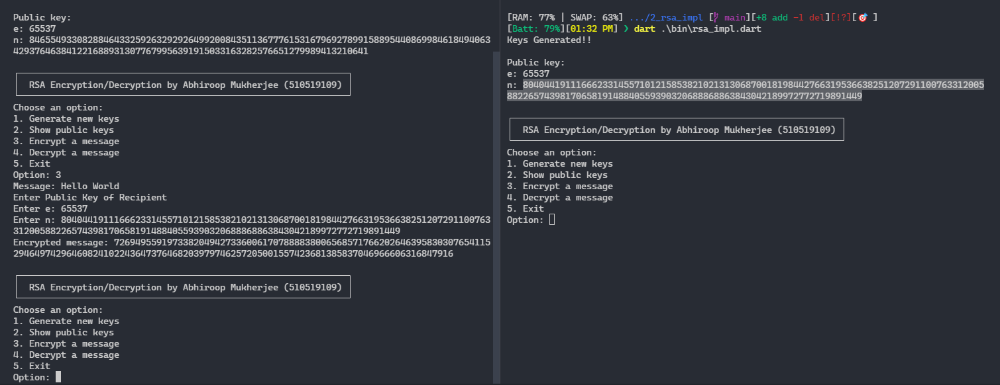

# RSA Implementation

Name: Abhiroop Mukherjee

Enrolment Number: 510519109

G-Suite ID: 510519109.abhirup@students.iiests.ac.in

## Implementation Info

1. Key Size = 256 Bits
2. Used dart's `BigInt` to store the big numbers
3. Implemented all the mathematical algorithm which can be found [here](https://github.com/Abhiroop25902/RSA-Impl/blob/main/bin/rsa.dart)

## Demo

-   Consider the left terminal as sender and right terminal as receiver

-   We see that terminals have different public keys, we are focussed in the public keys of receiver so Receiver Public Key:
    -   e: `65537`
    -   n: `8040441911166623314557101215853821021313068700181984427663195366382512072911007633120058822657439817065819148840559390320688868863843042189972772719891449`

-   Now let's encrypt 'Hello World' using receiver's public key

-   we got the ciphertext as `7269495591973382049427336006170788883800656857176620264639583030765411529464974296460824102243647376468203979746257205001557423681385837046966606316847916`

-   now lets decrypt the ciphertext using receiver's private key

-   we can see that the exact plaintext is decrypted from the receiver side
