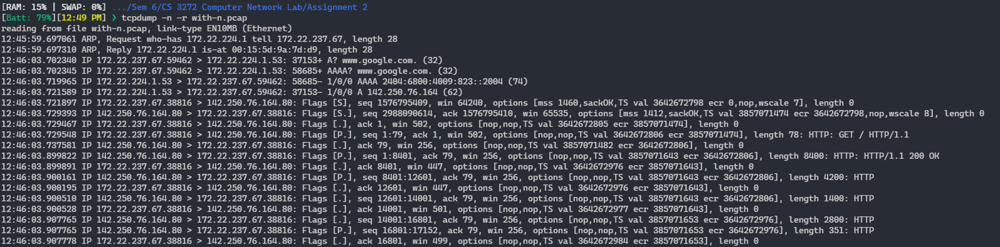
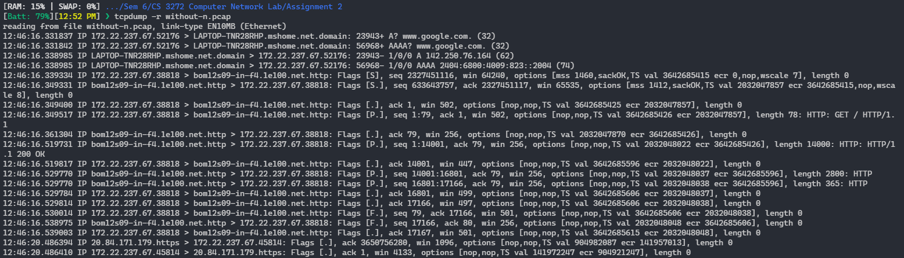
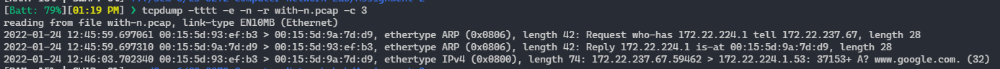
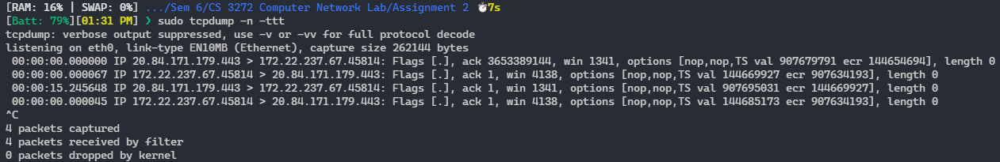
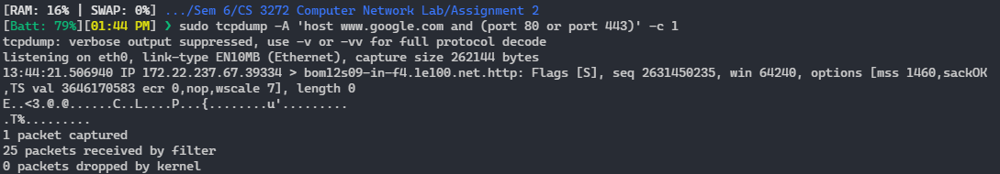
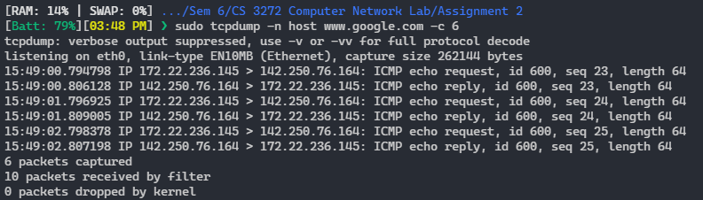
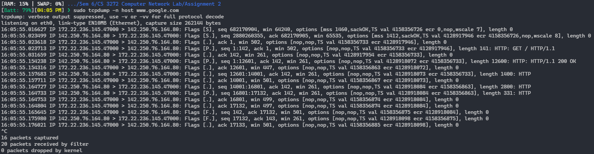
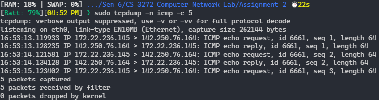
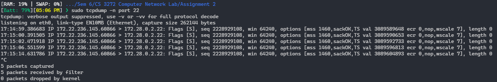

# Assignment 2

-   Name: Abhiroop Mukherjee
-   Roll No.: 510519109
-   GSuite: [510519109.abhirup@students.iiests.ac.in](mailto:510519109.abhirup@students.iiests.ac.in)
-   Subject: Computer Networks Lab (CS 3272)

# Question (a)

Check the version of the `tcpdump` and the `libpcap` utilities. Also find the number of interfaces available with your computer. Switch the network of eth0/eth1 (or the ethernet interface name as appeared) to promiscuous mode.

## Answer

1.  -   Check Version of tcpdump and libcap: `sudo tcpdump --version`
    -   ```man
        tcpdump version 4.9.3
        libpcap version 1.9.1 (with TPACKET_V3)
        OpenSSL 1.1.1f  31 Mar 2020
        ```

2.  -   Iterfaces available: `tcpdump -D`
    -   ```
        1.eth0 [Up, Running]
        2.lo [Up, Running, Loopback]
        3.any (Pseudo-device that captures on all interfaces) [Up, Running]
        4.bluetooth-monitor (Bluetooth Linux Monitor) [none]
        5.nflog (Linux netfilter log (NFLOG) interface) [none]
        6.nfqueue (Linux netfilter queue (NFQUEUE) interface) [none]
        7.dummy0 [none]
        8.tunl0 [none]
        9.sit0 [none]
        10.bond0 [none]
        ```

3.  -   Switch the network of eth0 to promiscuous mode: `sudo ifconfig eth0 promisc`
    -   Check if promiscuous mode is turned on: `ifconfig | grep PROMISC`
    -   ```
        eth0: flags=4419<UP,BROADCAST,RUNNING,PROMISC,MULTICAST>  mtu 1500
        ```
    -   hence turned on promiscuous mode and verified

<div style="page-break-after: always;"></div>

# Question (b)

Write the tcpdump command to capture 20 packets by listening to the promiscuous mode interface of your host and save the result as \*.pcap file (both with and without -n option).

## Answer

-   did `curl www.google.com` with both the commands

1. `sudo tcpdump -i eth0 -n -w "with-n.pcap" -c 20`
2. `sudo tcpdump -i eth0 -w "without-n.pcap" -c 20`

# Question (c)

Read the above file and identify the different fields present in TCP/IP packets captured by `tcpdump`.

## Answer

1. Read `with-n.pcap` : `tcpdump -n -r with-n.pcap`
   

2. Read `without-n.pcap` : `tcpdump -r without-n.pcap`
   

<div style="page-break-after: always;"></div>

3. consider the following packet (from `tcpdump -n -r with-n.pcap`):

    - `12:46:03.899822 IP 142.250.76.164.80 > 172.22.237.67.38816: Flags [P.], seq 1:8401, ack 79, win 256, options [nop,nop,TS val 3857071643 ecr 3642672806], length 8400: HTTP: HTTP/1.1 200 OK`

    | Data                    | Description                                                                                          |
    | ----------------------- | ---------------------------------------------------------------------------------------------------- |
    | `12:46:03.899822`       | Timestamp of the packet dumped                                                                       |
    | `IP`                    | IP protocol used, here its IPv4                                                                      |
    | `172.22.237.67.38816`   | Source IP address and port                                                                           |
    | `142.250.76.164.80`     | Destination IP address and port                                                                      |
    | `Flags [P.]`            | Flags of the packet, P means `PUSH` and . means `ACK`                                                |
    | `seq 1:8401`            | Sequence number of the packet                                                                        |
    | `ack 79`                | Acknowledgement number of the packet. 79 represents the next expected byts(data) on the network flow |
    | `win 256`               | Window size of the packet, represents the no. of bytes available in the receiving buffer             |
    | `length 8400`           | Length of the packet, reptesents the length in bytes of the payload data                             |
    | `HTTP: HTTP/1.1 200 OK` | Payload data, here HTTP 200 OK response to my laptop                                                 |

# Question (d)

Extract packet arrival time, source IP address, destination IP address and port.

## Answer

-   `tcpdump -tttt -n -r with-n.pcap -c 3`
-   
-   From the last record:
    -   packet arrival time: `12:46:03.702340`
    -   source IP address: `172.22.237.67`
    -   destination IP address: `172.22.224.1`
    -   destination port: `53`

<div style="page-break-after: always;"></div>

# Question (e)

Extract source MAC address and destination MAC addresses.

## Answer

-   we will use the `-e` tag to extract the MAC address: `tcpdump -tttt -e -n -r with-n.pcap -c 3`
-   
-   From the last record from the image:
    -   source MAC address: `00:15:5d:93:ef:b3`
    -   destination MAC address: `00:15:5d:9a:7d:d9`

# Question (f)

Get the inter-arrival times while capturing packets.

## Answer

-   the `-ttt` tag shows inter-arrival time instead of arrival time in the result
-   `sudo tcpdump -n -ttt`
-   

<div style="page-break-after: always;"></div>

# Question (g)

Use `tcpdump` to capture HTTP/HTTPS request and reply from [www.google.com](www.google.com). Also print the packet content in ASCII format.

## Answer

-   We will use the `-A` flag to also print the ASCII data of the packet payload
-   HTTP Default Port: 80
-   HTTPS Default Port 443
-   Host: [www.google.com](www.google.com)
-   Hence we will use the following command:
    -   `sudo tcpdump -A 'host www.google.com and (port 80 or port 443)' -c 1`
-   

# Question (h)

For each command, use `tcpdump` to capture the associated packets, and explain the different fields of each request and reply: (i) ping (ii) wget (iii) traceroute

## Answer

### `ping`

-   `sudo tcpdump -n host www.google.com -c 6` and `ping www.google.com -c 5`
    
-   my IP: 172.22.236.145
-   We can observe that `ping` uses ICMP Protocol for contacting hosts
-   We can observe that for every ICMP echo request given by my computer, it receives an ICMP echo request by the destination IP; all request having same size wich is the default 64 bytes given by ping

<div style="page-break-after: always;"></div>

### `wget`

-   `sudo tcpdump -n host www.google.com` and `wget www.google.com -O /tmp/index.html`

<!-- -   my IP: 172.22.236.145 -->

| Packet No. | Source               | Destination          | Packet Type        | Packet Length       |
| ---------- | -------------------- | -------------------- | ------------------ | ------------------- |
| 1          | 172.22.236.145.47000 | 142.250.76.164.80    | `[S]`-> SYN        | 0                   |
| 2          | 142.250.76.164.80    | 172.22.236.145.47000 | `[S.]` -> SYN ACK  | 0                   |
| 3          | 172.22.236.145.47000 | 142.250.76.164.80    | `[.]` -> ACK       | 0                   |
| 4          | 172.22.236.145.47000 | 142.250.76.164.80    | `[P.]` -> PUSH ACK | 141 -> GET REQ      |
| 5          | 142.250.76.164.80    | 172.22.236.145.47000 | `[.]` -> ACK       | 0                   |
| 6          | 142.250.76.164.80    | 172.22.236.145.47000 | `[P.]` -> PUSH ACK | 12600 -> 200 OK RES |
| 7          | 172.22.236.145.47000 | 142.250.76.164.80    | `[.]` -> ACK       | 0                   |
| 8          | 142.250.76.164.80    | 172.22.236.145.47000 | `[.]` -> ACK       | 1400 -> HTTP        |
| 9          | 172.22.236.145.47000 | 142.250.76.164.80    | `[.]` -> ACK       | 0                   |
| 10         | 142.250.76.164.80    | 172.22.236.145.47000 | `[.]` -> ACK       | 2800 -> HTTP        |
| 11         | 142.250.76.164.80    | 172.22.236.145.47000 | `[P.]` -> PUSH ACK | 331 -> HTTP         |
| 12         | 172.22.236.145.47000 | 142.250.76.164.80    | `[.]` -> ACK       | 0                   |
| 13         | 172.22.236.145.47000 | 142.250.76.164.80    | `[.]` -> ACK       | 0                   |
| 14         | 172.22.236.145.47000 | 142.250.76.164.80    | `[F.]` -> FIN ACK  | 0                   |
| 15         | 142.250.76.164.80    | 172.22.236.145.47000 | `[F.]` -> FIN ACK  | 0                   |
| 16         | 172.22.236.145.47000 | 142.250.76.164.80    | `[.]` -> ACK       | 0                   |

### `traceroute`

-   `sudo tcpdump -n` and `sudo traceroute www.google.com -I`
-   `-I` will give ICMP requests for traceroute
-   
-   

<div style="page-break-after: always;"></div>

-   First some DNS Resolution happens

```
16:29:37.939300 IP 172.22.236.145.47873 > 172.22.224.1.53: 25186+ A? www.google.com. (32)
16:29:37.939336 IP 172.22.236.145.47873 > 172.22.224.1.53: 30318+ AAAA? www.google.com. (32)
16:29:37.940126 IP 172.22.224.1.53 > 172.22.236.145.47873: 25186- 1/0/0 A 142.250.76.164 (62)
16:29:37.950546 IP 172.22.224.1.53 > 172.22.236.145.47873: 30318- 1/0/0 AAAA 2404:6800:4009:813::2004 (74)
```

-   Then many ICMP echo requests are sent

```
16:29:37.951268 IP 172.22.236.145 > 142.250.76.164: ICMP echo request, id 4000, seq 1, length 40
16:29:37.951294 IP 172.22.236.145 > 142.250.76.164: ICMP echo request, id 4000, seq 2, length 40
16:29:37.951298 IP 172.22.236.145 > 142.250.76.164: ICMP echo request, id 4000, seq 3, length 40
16:29:37.951300 IP 172.22.236.145 > 142.250.76.164: ICMP echo request, id 4000, seq 4, length 40
16:29:37.951303 IP 172.22.236.145 > 142.250.76.164: ICMP echo request, id 4000, seq 5, length 40
16:29:37.951305 IP 172.22.236.145 > 142.250.76.164: ICMP echo request, id 4000, seq 6, length 40
...
```

-   We then recieve some ICMP time exceeded in-transit, which shows us the working of traceroute

```
16:29:37.951785 IP 172.22.224.1 > 172.22.236.145: ICMP time exceeded in-transit, length 68
16:29:37.951846 IP 172.22.224.1 > 172.22.236.145: ICMP time exceeded in-transit, length 68
16:29:37.951846 IP 172.22.224.1 > 172.22.236.145: ICMP time exceeded in-transit, length 68
...
```

<div style="page-break-after: always;"></div>

# Question (i)

Write the `tcpdump` command that captures packets containing TCP packets with a specific IP address as (i) both source and destination, (ii) only source, and (iii) only destination.

## Answer

-   My IP: 172.22.236.145
-   Both Source and Destination
    -   `sudo tcpdump -n src 172.22.236.145 and dst www.google.com`
-   Only Source
    -   `sudo tcpdump -n src www.google.com`
-   Only Destination
    -   `sudo tcpdump -n dst 172.22.236.145`

# Question (j)

Write the `tcpdump` command that captures packets containing ICMP packets between two hosts with different IP addresses.

## Answer

-   `sudo tcpdump -n icmp -c 5`
-   we specify the icmp protocol as a filter in `tcpdump`
-   

<div style="page-break-after: always;"></div>

# Question (k)

Write the `tcpdump` command to capture packets containing SSH request and reply between two specific IP addresses (hint: use port number 22 for SSH).

## Answer

-   `sudo tcpdump -n port 22`
-   
