# Assignment 3

-   Name: Abhiroop Mukherjee
-   Roll No.: 510519109
-   GSuite: [510519109.abhirup@students.iiests.ac.in](mailto:510519109.abhirup@students.iiests.ac.in)
-   Subject: Computer Networks Lab (CS 3272)

# Question 1

Analyse the packets (across all layers) exchanged with your computer while executing the following commands:

1. ping
2. traceroute
3. dig
4. arp
5. wget

## `1. ping`

`ping` uses ICMP (Internet Control Message Protocol) to send messages to a host. Running `ping www.google.com` in terminal and then capturing the packets via wireshark, we observe the following:

### Echo Request Packet

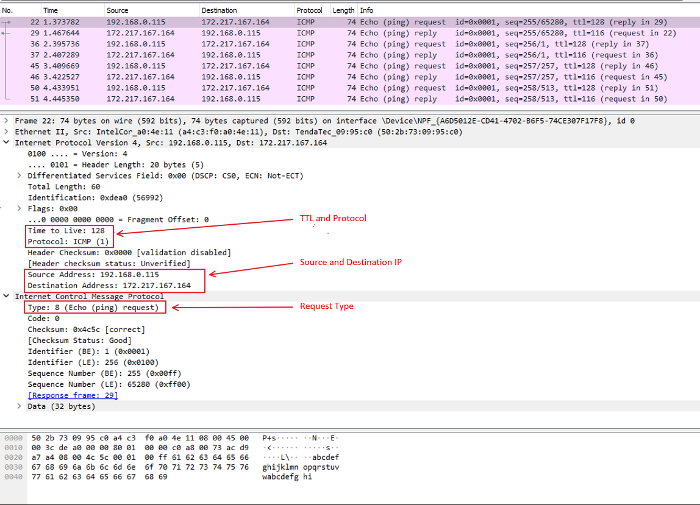

-   Protocol: ICMP
-   Type: 8 (Echo (ping) request)
-   TTL: 128

### Echo Reply Packet

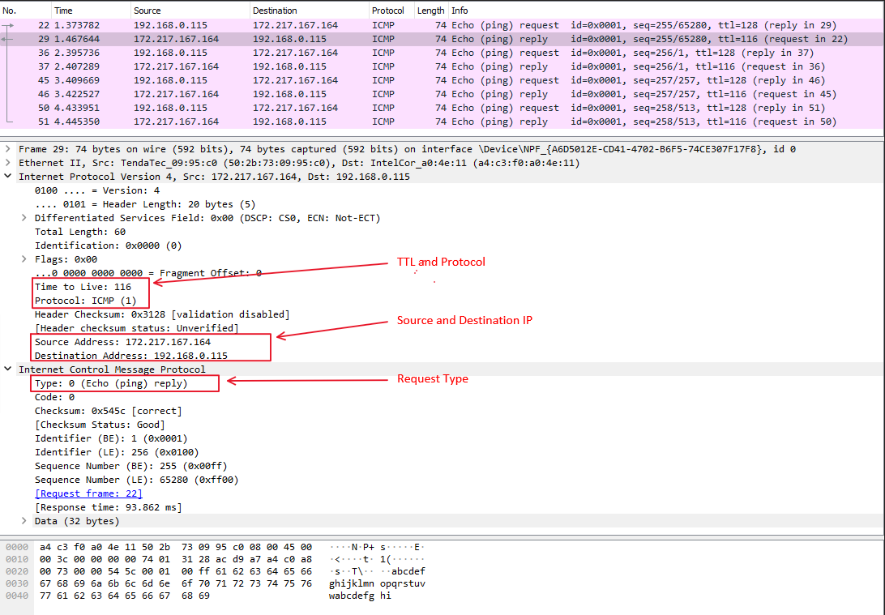

-   Protocol: ICMP
-   Type: 0 (Echo (ping) reply)
-   TTL: 116

## Protocol Info

|  Layer  | Protocol Used |
| :-----: | :-----------: |
| Network |     ICMP      |

NOTE: ICMP is not associated with a transport layer protocol like TCP or UDP.

## `2. traceroute`

The way `traceroute` works is by sending packets with increasing TTL and rely on "TTL Exceeded" packets from the routers to trace the path to a host.

Running `traceroute -I www.google.com` in terminal and then capturing the packets via wireshark, we observe the following:

Here we can observe that my host is sending ICMP echo request packets with increasing TTL and the routers are responding with "TTL Exceeded" packets.

We also see that all packets sent from my IP (192.168.0.115) have destination IP address (the IP address found by DNS lookup of www.google.com).

### Protocol Info

Since we used the `-I` flag, the protocol used is ICMP.

|  Layer  | Protocol Used |
| :-----: | :-----------: |
| Network |     ICMP      |

## `3. dig`

We know that `dig` uses DNS protocol, so we can add "dns" filter in wireshark.

Running `dig www.google.com` in terminal and then capturing the packets via wireshark, we observe the following:

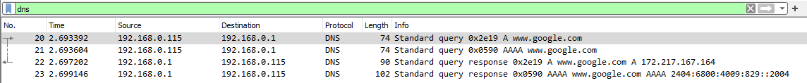

### DNS request:

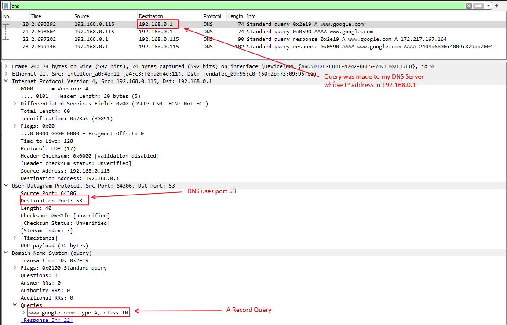

-   Query made from DNS Server 192.168.0.1
-   Query: "www.google.com: type A, class IN"

### DNS response:

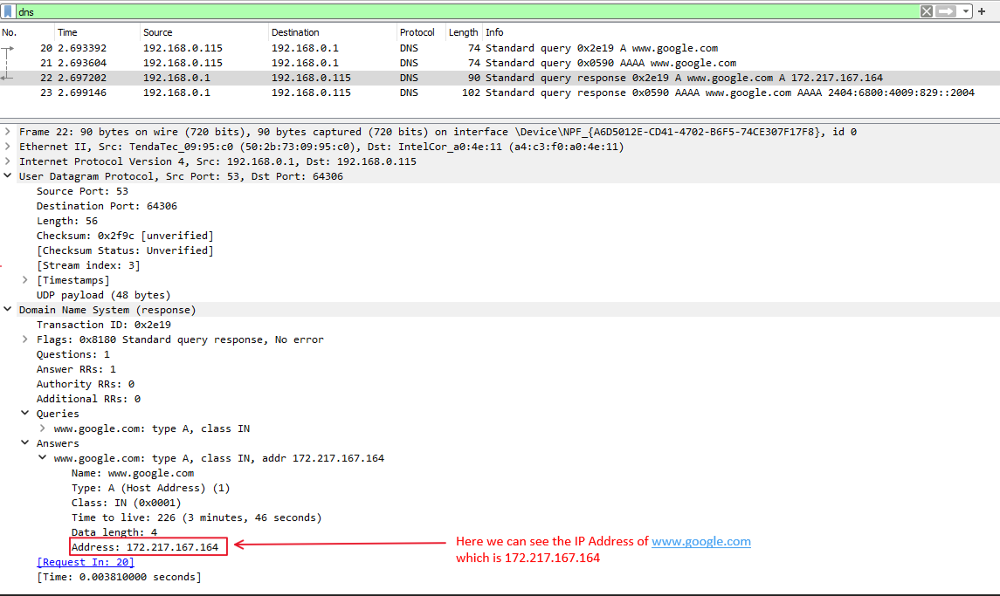

-   We received an A record for `www.google.com` with address `172.217.167.164`

### Protocol Info

-   Protocol used here is DNS

|    Layer    | Protocol Used |
| :---------: | :-----------: |
| Application |      DNS      |
|  Transport  |      UDP      |
|   Network   |      IP       |

## `4. arp`

`arp` maintains a table of mac addresses and corresponding IP addresses. So when we run `arp` command, it sends a broadcast packet to all the hosts in the network.

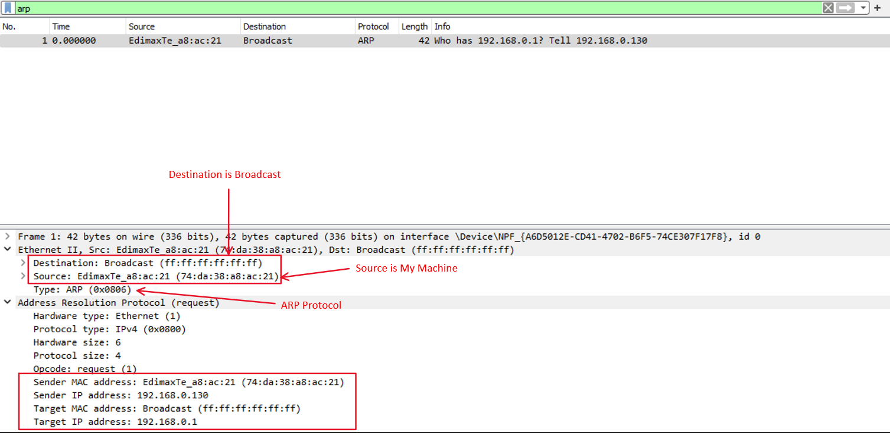

-   Destination: Broadcast `(ff:ff:ff:ff:ff:ff)`

### Protocol Info

-   Protocol: ARP

|  Layer  | Protocol Used |
| :-----: | :-----------: |
| Network |      ARP      |

## `5. wget`

`wget` makes a GET HTTP(S) request to a server and downloads the file. Running `wget www.google.com` in terminal and then capturing the packets via wireshark, we observe the following:

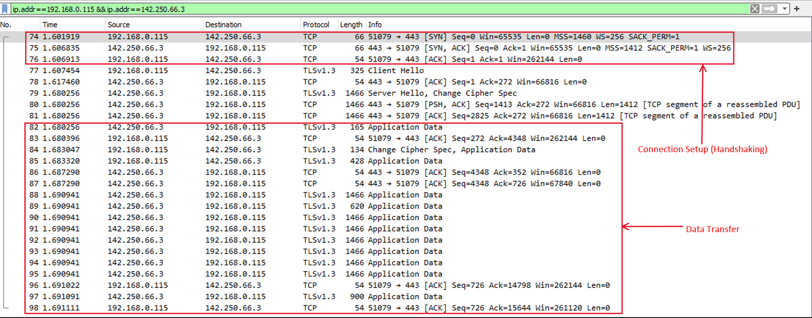

-   First Packet was sent with `SYN` flag set
-   Second Packet was sent with `SYN-ACK` flag set
-   Finally, Third Packet was sent with `ACK` flag set
-   Now the handshaking is done, data transfer starts

Looking at a packet of Data Transfer we see:

-   here all data is gibberish, because it was end-to-end encrypted. The request was made through HTTPS protocol which makes it impossible for sniffers like wireshark to decode the data.

### Protocol Info

-   Application Layer Protocol: HTTPS
-   Transport Layer Protocol: TCP
-   Network Layer Protocol: IP

|    Layer    | Protocol Used |
| :---------: | :-----------: |
| Application |     HTTPS     |
|  Transport  |      TCP      |
|   Network   |      IP       |

# Question 2

Capture the packets while sending/receiving `telnet` request/response between your computer and a custom server running the `telnet` daemon. What is your observation while analyzing the application layer data?

## Packet Capture

I have set up a telnet daemon in a VM which is in Bridged Mode. The VM's IP is `192.168.0.174`. I have installed telnetd which is actively listening on port 23.

Connecting to VM via `telnet 192.168.0.174` and then capturing the packets via wireshark, we observe the following:

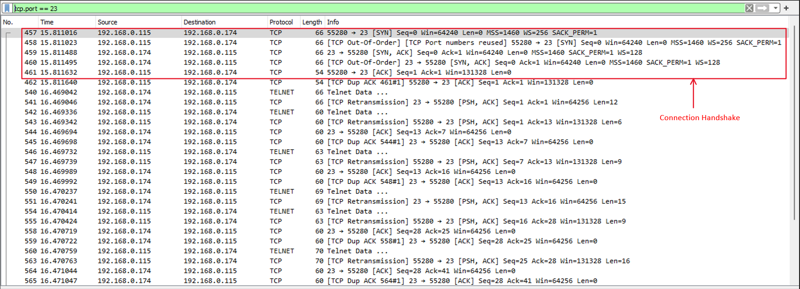

We observe that same three-way TCP handshaking is done between the telnet client and the telnet daemon.

After that every data is passed though the `TELNET` Protocol.

## Observing the `TELNET` packets

-   NOTE: Data Transfer is not encrypted and can be easily seen by sniffing softwares like wireshark.

# Question 3

Capture the packets while sending/receiving `ssh` request/response between your computer and one of the department servers. What is your observation while analyzing the application layer data?

## Packet Capture

`SSH` uses asymmetric cryptography to establish a shared secret key then uses the symmetric cryptography with the shared key for the remote session.

So, the first step of ssh will be to establish a shared secret key. Here we can see the server and the client initiating the key exchange via Elliptic Curve Diffie-Hellman (ECDH) key exchange algorithm.

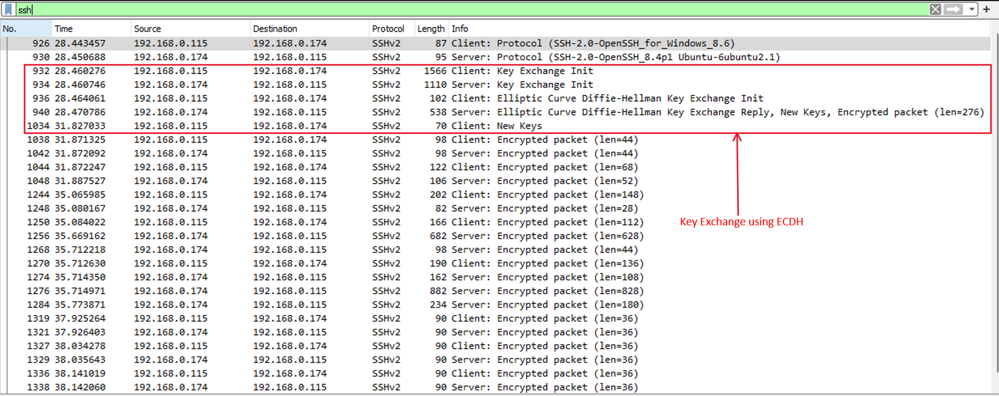

After this the symmetric key is agreed upon the client and the server and all the remote session data is encrypted using the shared key.

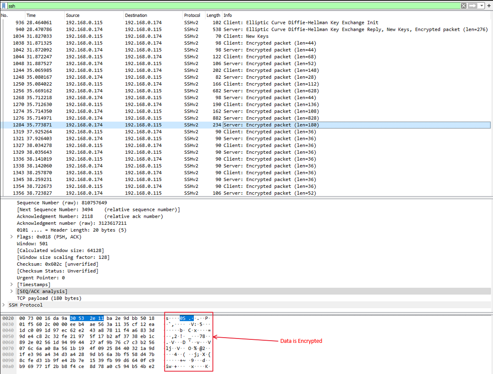

# Question 4

Enter the URL: [http://gaia.cs.umass.edu/wireshark-labs/INTRO-wireshark-file1.html](http://gaia.cs.umass.edu/wireshark-labs/INTRO-wireshark-file1.html) and capture packets using `Wireshark`. After your browser has displayed the INTRO-wireshark-file1.html`page (it is a simple one line of congratulations), stop`Wireshark` packet capture. Answer the following from the packets captured:

1. How long did it take from when the `HTTP GET` message was sent until the `HTTP OK` reply was received?

2. What is the Internet address of the `gaia.cs.umass.edu`? What is the Internet address of your computer? Support your answer with an appropriate screenshot from your computer.

## 1. How long did it take from when the `HTTP GET` message was sent until the `HTTP OK` reply was received?

The first `GET` request was made in 0.504310921 s

[Time since first frame in this TCP stream: 0.504310921 seconds]

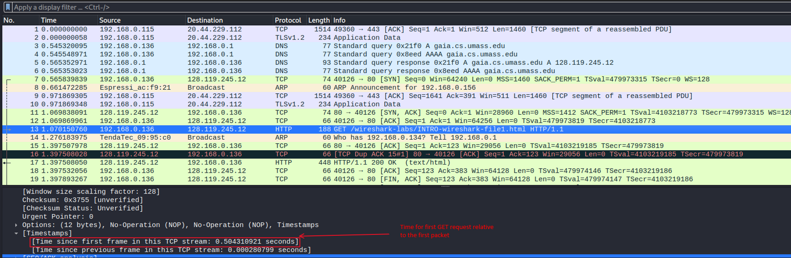

The first `GET` request was made in 0.831668211 s

[Time since first frame in this TCP stream: 0.83166821 seconds]

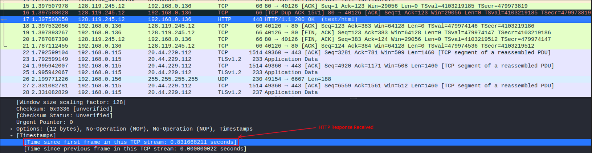

So Time Taken = 0.831668211 - 0.504310921 = 0.32735729 s

## 2. What is the Internet address of the `gaia.cs.umass.edu`? What is the Internet address of your computer? Support your answer with an appropriate screenshot from your computer.

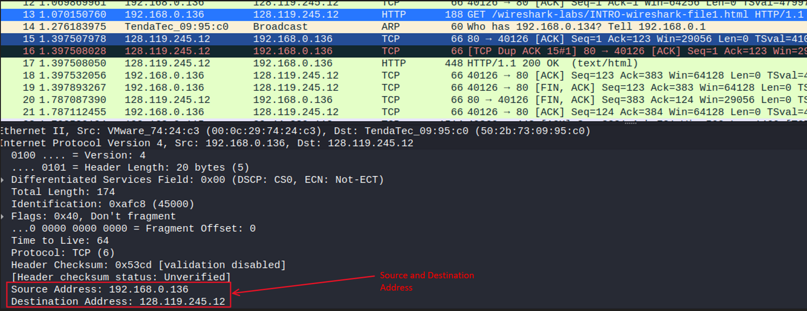

-   IP address of `gaia.cs.umass.edu` is `Destination Address: 128.119.245.12`
-   IP address of my computer is `Source Address: 192.168.0.136`

# Question 5

Start the `Wireshark` packet capturing service. Enter the URL: [https://www.gmail.com/](https://www.gmail.com/) on your browser and sign-in to your gmail account by providing credentials (Username/Password). Answer the following from the captured packets:

1. Is there any difference in the application layer protocol?
2. How it is different from the `HTTP` data you analysed in the above problem?

## 1. Is there any difference in the application layer protocol?

Yes, the current application layer protocol is `TLS` . A primary use case of `TLS` is encrypting the communication between web applications and servers, such as web browsers loading a website.

But, in the previous case it was just `HTTP`.

## 2. How it is different from the `HTTP` data you analysed in the above problem?

Previously, the protocol used was simple HTTP. As a result sniffers like wireshark could decode the data. Here is an example:

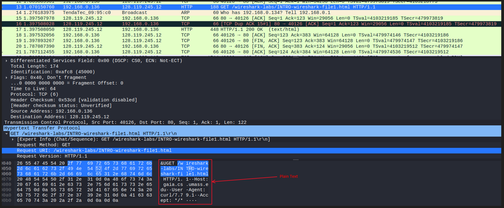

But [https://www.gmail.com/](https://www.gmail.com/) is using `HTTPS` with `TLS`. So the data will be encrypted.

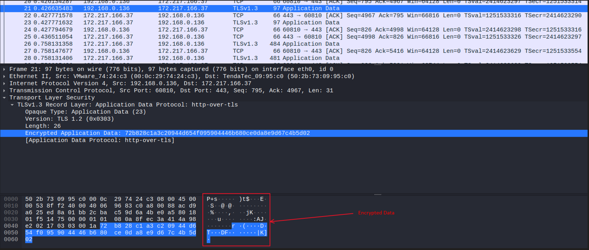

here sniffers like wireshark cannot decode the data. Hence some random person could read the username and password from the packets.
