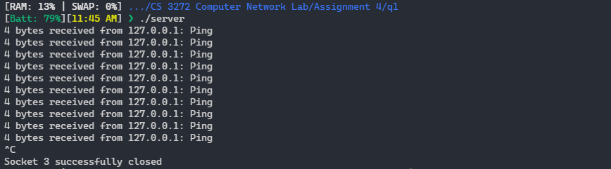
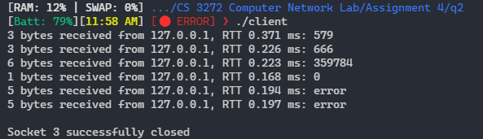
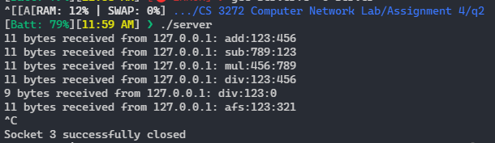

# Assignment 4

-   Name: Abhiroop Mukherjee
-   Roll No.: 510519109
-   GSuite: [510519109.abhirup@students.iiests.ac.in](mailto:510519109.abhirup@students.iiests.ac.in)
-   Subject: Computer Networks Lab (CS 3272)

# Question 1: Ping Pong

## Code

### `server.c`

```c
/**
 * @file server.c
 * @author Abhiroop Mukherjee (510519109.abhirup@students.iiests.ac.in)
 * @brief Assignment 4 q2 Server Side
 * @version 0.2
 * @date 2022-02-20
 *
 * @copyright Copyright (c) 2022
 *
 */

#include <stdio.h>
#include <sys/types.h>  //socket()
#include <sys/socket.h> //socket()
#include <stdlib.h>     // exit()
#include <netinet/in.h> // Internet family of protocols
#include <arpa/inet.h>  // struct sockaddr_in
#include <unistd.h>     //close()
#include <string.h>     //strlen()
#include <stdbool.h>    //for true and false
#include <signal.h>     //signal() and sighandler_t

#define SERVERIP "127.0.0.1"
#define SERVERPORT 50000
#define BUFFSIZE 1024

int sockfd; // global for sighandler

typedef void (*sighandler_t)(int);

/**
 * @brief close the socket and the program
 *
 */
void terminateProgram()
{
    printf("\n");
    int status = close(sockfd);

    if (status == 0)
        fprintf(stderr, "Socket %d successfully closed\n", sockfd);
    else if (status == -1)
        perror("socket could not be closed\n");

    exit(1);
}

/**
 * @brief wrapper for socket() function with error detection, do "man socket" to get full info
 *
 * @param domain
 * @param type
 * @param protocol
 * @return int
 */
int getSockId(int domain, int type, int protocol)
{
    int sockfd = socket(domain, type, protocol);

    if (sockfd == -1)
    {
        perror("cannot create socket");
        exit(1);
    }

    return sockfd;
}

/**
 * @brief wrapper for bind, "man bind" for more info
 *
 * @param sockfd socket file descriptor from socket()
 * @param host_sin_family
 * @param hostPort host port number, 0 for autoselect
 * @param hostIpAddr host IP address in string format
 * @param useCurrIp if true, uses your computer's current IP address instead of hostIPAddr provided
 */
void bindWrapper(
    sa_family_t host_sin_family,
    in_port_t hostPort,
    const char *hostIpAddr,
    bool useCurrIp)
{
    struct sockaddr_in hostAddr;
    hostAddr.sin_family = host_sin_family;
    hostAddr.sin_port = htons(hostPort); // choose any port at random

    if (useCurrIp)
        hostAddr.sin_addr.s_addr = INADDR_ANY;
    else
        hostAddr.sin_addr.s_addr = inet_addr(hostIpAddr); // converts string based IP to network based IP

    int status = bind(sockfd, (const struct sockaddr *)&hostAddr, sizeof(hostAddr));

    if (status == -1)
    {
        perror("bind fail");
        terminateProgram();
    }
}

/**
 * @brief wrapper for sendto(), do "man sendto" for more info
 *
 * @param sockfd socket file descriptor,
 * @param dest_sin_family
 * @param destPort destination port number
 * @param destIp string based dest IP
 * @param data actual data you want to send
 * @param dataSize size of the data
 * @param flags
 */
void sendData(
    sa_family_t dest_sin_family,
    int destPort,
    const char *destIp,
    void *data,
    int dataSize,
    int flags)
{
    struct sockaddr_in addr;
    addr.sin_family = dest_sin_family;
    addr.sin_port = htons(destPort);          // choose any port at random
    addr.sin_addr.s_addr = inet_addr(destIp); // converts string based IP to network based IP

    int dataSent = sendto(sockfd, data, dataSize, flags,
                          (struct sockaddr *)&addr, sizeof(addr));
    if (dataSent < 0)
    {
        perror("cannot send");
        terminateProgram();
    }
}

/**
 * @brief wrapper for recvfrom() with error checking, "man recvfrom" to get more info
 *
 * @param sockfd socket file descriptor
 * @param buff buffer to store data into
 * @param buffSize maximum size of the buffer
 * @param flags
 * @param packAddrPtr pointer to a struct sockaddr to store data about address of incoming packet
 * @param packAddrLenPtr pointer to an int to store the length of incoming packAddrPtr
 * @return int amount of bytes received
 */
int recvData(
    void *buff,
    int buffSize,
    int flags,
    struct sockaddr *packAddrPtr,
    int *packAddrLenPtr)
{

    int dataBytes = recvfrom(sockfd, buff, buffSize, flags, packAddrPtr, packAddrLenPtr);
    if (dataBytes < 0)
    {
        perror("Data Receive Error");
    }

    return dataBytes;
}

int main()
{
    signal(SIGINT, terminateProgram);
    sockfd = getSockId(AF_INET, SOCK_DGRAM, 0);
    // domain -> PF_INET foe Internet communication
    // type -> SOCK_DGRAM for UDP
    // protocol -> 0 to make OS auto select
    // return sockfd if success, or -1 if error (perror set accordingly)

    bindWrapper(AF_INET, SERVERPORT, SERVERIP, true);
    // sockfd -> socket file descriptor from socket(), global
    // host_sin_family -> kept AF_INET (address family INET) for internet connection
    // hostPort -> kept 0 for auto select
    // hostIpAddr -> string based IP address

    int dataBytes;
    char buff[BUFFSIZE];
    struct sockaddr_in packetAddr;
    int packetAddrLen = sizeof(packetAddr);
    char *dataToSend = "Pong";
    while (1)
    {
        dataBytes = recvData(buff, BUFFSIZE - 1, 0, (struct sockaddr *)&packetAddr, &packetAddrLen);
        //  sockfd -> socket file descriptor, global
        //  buff -> buffer to store data into
        //  buffSize -> maximum size of the buffer
        //  flags -> kept 0 for now
        //  packAddrPtr -> pointer to a struct sockaddr to store data about address of incoming packet
        //  packAddrLenPtr -> pointer to an int to store the length of incoming packAddrPtr

        if (dataBytes > 0)
        {
            buff[dataBytes] = '\0';
            printf("%d bytes received from %s: %s \n", dataBytes, inet_ntoa(packetAddr.sin_addr), buff);

            sendData(AF_INET, ntohs(packetAddr.sin_port), inet_ntoa(packetAddr.sin_addr), dataToSend, strlen(dataToSend), 0);
            // int sockfd -> socket file descriptor, global
            // sa_family_t dest_sin_family -> AF_INET for Internet,
            // int destPort -> destination port number,
            // const char *destIp -> string based dest IP,
            // void *data -> actual data you want to send,
            // int dataSize -> size of the data,
            // int flags -> kept 0 for now
        }

        sleep(2); // to simulate drop packets on client side (packets will be queued tho)
    }

    return 0;
}
```

<div style="page-break-after: always;"></div>

### `client.c`

```c
/**
 * @file client.c
 * @author Abhiroop Mukherjee (510519109.abhirup@students.iiests.ac.in)
 * @brief Assignment 4 q1 Client Side
 * @version 0.2
 * @date 2022-02-20
 *
 * @copyright Copyright (c) 2022
 *
 */

#include <stdio.h>
#include <sys/types.h>  //socket()
#include <sys/socket.h> //socket()
#include <stdlib.h>     // exit()
#include <netinet/in.h> // Internet family of protocols
#include <arpa/inet.h>  // struct sockaddr_in
#include <unistd.h>     //close()
#include <string.h>     //strlen()
#include <stdbool.h>    //for true and false
#include <sys/time.h>   //gettimeofday()

#define SERVERIP "127.0.0.1"
#define SERVERPORT 50000
#define BUFFSIZE 1024
#define HOSTIP "127.0.0.1"

int sockfd;

/**
 * @brief close the socket and the program
 *
 */
void terminateProgram()
{
    printf("\n");
    int status = close(sockfd);

    if (status == 0)
        fprintf(stderr, "Socket %d successfully closed\n", sockfd);
    else if (status == -1)
        perror("socket could not be closed\n");

    exit(1);
}

/**
 * @brief wrapper for socket() function with error detection, do "man socket" to get full info
 *
 * @param domain
 * @param type
 * @param protocol
 * @return int
 */
int getSockId(int domain, int type, int protocol)
{
    int sockfd = socket(domain, type, protocol);

    if (sockfd == -1)
    {
        perror("cannot create socket");
        exit(1);
    }

    return sockfd;
}

/**
 * @brief Set the Socket Timeout Period
 *
 * @param sockfd
 * @param timeout_in_seconds
 * @param timeout_in_usec
 */
void setSocketTimeoutPeriod(int timeout_in_seconds, int timeout_in_usec)
{
    struct timeval tv;
    tv.tv_sec = timeout_in_seconds;
    tv.tv_usec = timeout_in_usec;
    int status = setsockopt(sockfd, SOL_SOCKET, SO_RCVTIMEO, (const char *)&tv, sizeof tv);
    // int setsockopt(int sockfd, int level, int optname, const void *optval, socklen_t optlen);
    // level -> SOL_SOCKET to define that the optional parameter set is for Socket Level API in network stack
    // optname -> SO_RCVTIMEO to day that we are defining a timeout
    if (status == -1)
    {
        perror("Socket Timeout Set Fail");
        terminateProgram();
    }
}

/**
 * @brief wrapper for bind, "man bind" for more info
 *
 * @param sockfd socket file descriptor from socket()
 * @param host_sin_family
 * @param hostPort host port number, 0 for autoselect
 * @param hostIpAddr host IP address in string format
 * @param useCurrIp if true, uses your computer's current IP address instead of hostIPAddr provided
 */
void bindWrapper(
    sa_family_t host_sin_family,
    in_port_t hostPort,
    const char *hostIpAddr,
    bool useCurrIp)
{
    struct sockaddr_in hostAddr;
    hostAddr.sin_family = host_sin_family;
    hostAddr.sin_port = htons(hostPort); // choose any port at random

    if (useCurrIp)
        hostAddr.sin_addr.s_addr = INADDR_ANY;
    else
        hostAddr.sin_addr.s_addr = inet_addr(hostIpAddr); // converts string based IP to network based IP

    int status = bind(sockfd, (const struct sockaddr *)&hostAddr, sizeof(hostAddr));

    if (status == -1)
    {
        perror("bind fail");
        terminateProgram();
    }
}

/**
 * @brief wrapper for sendto(), do "man sendto" for more info
 *
 * @param sockfd socket file descriptor,
 * @param dest_sin_family
 * @param destPort destination port number
 * @param destIp string based dest IP
 * @param data actual data you want to send
 * @param dataSize size of the data
 * @param flags
 */
void sendData(
    sa_family_t dest_sin_family,
    int destPort,
    const char *destIp,
    void *data,
    int dataSize,
    int flags)
{
    struct sockaddr_in addr;
    addr.sin_family = dest_sin_family;
    addr.sin_port = htons(destPort);          // choose any port at random
    addr.sin_addr.s_addr = inet_addr(destIp); // converts string based IP to network based IP

    int dataSent = sendto(sockfd, data, dataSize, flags,
                          (struct sockaddr *)&addr, sizeof(addr));
    if (dataSent < 0)
    {
        perror("cannot send");
        terminateProgram();
    }
}

/**
 * @brief wrapper for recvfrom() with error checking, "man recvfrom" to get more info
 *
 * @param sockfd socket file descriptor
 * @param buff buffer to store data into
 * @param buffSize maximum size of the buffer
 * @param flags
 * @param packAddrPtr pointer to a struct sockaddr to store data about address of incoming packet
 * @param packAddrLenPtr pointer to an int to store the length of incoming packAddrPtr
 * @return int amount of bytes received
 */
int recvData(
    void *buff,
    int buffSize,
    int flags,
    struct sockaddr *packAddrPtr,
    int *packAddrLenPtr)
{

    int dataBytes = recvfrom(sockfd, buff, buffSize, flags, packAddrPtr, packAddrLenPtr);
    if (dataBytes < 0)
        fprintf(stderr, "Request Timed Out\n");

    return dataBytes;
}

int main()
{
    sockfd = getSockId(AF_INET, SOCK_DGRAM, 0);
    // domain -> PF_INET foe Internet communication
    // type -> SOCK_DGRAM for UDP
    // protocol -> 0 to make OS auto select
    // return sockfd if success, or -1 if error (perror set accordingly)

    setSocketTimeoutPeriod(1, 0); // set socket listening timeout period

    bindWrapper(AF_INET, 0, HOSTIP, true);
    // sockfd -> socket file descriptor from socket(), global
    // host_sin_family -> kept AF_INET (address family INET) for internet connection
    // hostPort -> kept 0 for auto select
    // hostIpAddr -> string based IP address
    // useCurrIp -> true to make the function use your computer IP address instead of hostIpAddress provided

    char *dataToSend = "Ping";
    char buff[BUFFSIZE];
    struct sockaddr_in packetAddr;
    int packetAddrLen = sizeof(packetAddr);
    int dataBytes;
    struct timeval tp;
    long double start, end;

    for (int i = 0; i < 10; i++)
    {
        gettimeofday(&tp, NULL);
        start = tp.tv_sec * 1000 + ((long double)tp.tv_usec) / 1000;
        sendData(AF_INET, SERVERPORT, SERVERIP, dataToSend, strlen(dataToSend), 0);
        // int sockfd -> socket file descriptor, global
        // sa_family_t dest_sin_family -> AF_INET for Internet,
        // int destPort -> destination port number,
        // const char *destIp -> string based dest IP,
        // void *data -> actual data you want to send,
        // int dataSize -> size of the data,
        // int flags -> kept 0 for now

        dataBytes = recvData(buff, BUFFSIZE - 1, 0, (struct sockaddr *)&packetAddr, &packetAddrLen);
        //  sockfd -> socket file descriptor, global
        //  buff -> buffer to store data into
        //  buffSize -> maximum size of the buffer
        //  flags -> kept 0 for now
        //  packAddrPtr -> pointer to a struct sockaddr to store data about address of incoming packet
        //  packAddrLenPtr -> pointer to an int to store the length of incoming packAddrPtr

        gettimeofday(&tp, NULL);
        end = tp.tv_sec * 1000 + ((long double)tp.tv_usec) / 1000;
        if (dataBytes > 0)
        {
            buff[dataBytes] = '\0';
            printf("%d bytes received from %s, RTT %.3Lf ms: %s \n", dataBytes, inet_ntoa(packetAddr.sin_addr), end - start, buff);
        }
    }
    terminateProgram();

    return 0;
}
```

<div style="page-break-after: always;"></div>

## Screenshot

### Client


### Server



<div style="page-break-after: always;"></div>

# Question 2: Mathe-Magic

## Code

### `server.c`

```c
/**
 * @file server.c
 * @author Abhiroop Mukherjee (510519109.abhirup@students.iiests.ac.in)
 * @brief Assignment 4 q2 Server Side
 * @version 0.1
 * @date 2022-02-20
 *
 * @copyright Copyright (c) 2022
 *
 */

#include <stdio.h>
#include <sys/types.h>  // socket()
#include <sys/socket.h> // socket()
#include <stdlib.h>     // exit(), atoi()
#include <netinet/in.h> // Internet family of protocols
#include <arpa/inet.h>  // struct sockaddr_in
#include <unistd.h>     // close()
#include <string.h>     // strlen(), strtok(), strcmp()
#include <stdbool.h>    // for true and false
#include <signal.h>     // signal() and sighandler_t

#define SERVERIP "127.0.0.1"
#define SERVERPORT 50000
#define BUFFSIZE 1024

int sockfd; // global for sighandler

typedef void (*sighandler_t)(int);

/**
 * @brief close the socket and the program
 *
 */
void terminateProgram()
{
    printf("\n");
    int status = close(sockfd);

    if (status == 0)
        fprintf(stderr, "Socket %d successfully closed\n", sockfd);
    else if (status == -1)
        perror("socket could not be closed\n");

    exit(1);
}

/**
 * @brief wrapper for socket() function with error detection, do "man socket" to get full info
 *
 * @param domain
 * @param type
 * @param protocol
 * @return int
 */
int getSockId(int domain, int type, int protocol)
{
    int sockfd = socket(domain, type, protocol);

    if (sockfd == -1)
    {
        perror("cannot create socket");
        exit(1);
    }

    return sockfd;
}

/**
 * @brief wrapper for bind, "man bind" for more info
 *
 * @param sockfd socket file descriptor from socket()
 * @param host_sin_family
 * @param hostPort host port number, 0 for autoselect
 * @param hostIpAddr host IP address in string format
 * @param useCurrIp if true, uses your computer's current IP address instead of hostIPAddr provided
 */
void bindWrapper(
    sa_family_t host_sin_family,
    in_port_t hostPort,
    const char *hostIpAddr,
    bool useCurrIp)
{
    struct sockaddr_in hostAddr;
    hostAddr.sin_family = host_sin_family;
    hostAddr.sin_port = htons(hostPort); // choose any port at random

    if (useCurrIp)
        hostAddr.sin_addr.s_addr = INADDR_ANY;
    else
        hostAddr.sin_addr.s_addr = inet_addr(hostIpAddr); // converts string based IP to network based IP

    int status = bind(sockfd, (const struct sockaddr *)&hostAddr, sizeof(hostAddr));

    if (status == -1)
    {
        perror("bind fail");
        terminateProgram();
    }
}

/**
 * @brief wrapper for sendto(), do "man sendto" for more info
 *
 * @param sockfd socket file descriptor,
 * @param dest_sin_family
 * @param destPort destination port number
 * @param destIp string based dest IP
 * @param data actual data you want to send
 * @param dataSize size of the data
 * @param flags
 */
void sendData(
    sa_family_t dest_sin_family,
    int destPort,
    const char *destIp,
    void *data,
    int dataSize,
    int flags)
{
    struct sockaddr_in addr;
    addr.sin_family = dest_sin_family;
    addr.sin_port = htons(destPort);          // choose any port at random
    addr.sin_addr.s_addr = inet_addr(destIp); // converts string based IP to network based IP

    int dataSent = sendto(sockfd, data, dataSize, flags,
                          (struct sockaddr *)&addr, sizeof(addr));
    if (dataSent < 0)
    {
        perror("cannot send");
        terminateProgram();
    }
}

/**
 * @brief wrapper for recvfrom() with error checking, "man recvfrom" to get more info
 *
 * @param sockfd socket file descriptor
 * @param buff buffer to store data into
 * @param buffSize maximum size of the buffer
 * @param flags
 * @param packAddrPtr pointer to a struct sockaddr to store data about address of incoming packet
 * @param packAddrLenPtr pointer to an int to store the length of incoming packAddrPtr
 * @return int amout of bytes received
 */
int recvData(
    void *buff,
    int buffSize,
    int flags,
    struct sockaddr *packAddrPtr,
    int *packAddrLenPtr)
{

    int dataBytes = recvfrom(sockfd, buff, buffSize, flags, packAddrPtr, packAddrLenPtr);
    if (dataBytes < 0)
        perror("Request Timed Out");

    return dataBytes;
}

/**
 * @brief str format is "operator:operand1:operand2"
 * extract operator, operand1 and operand2 and computes te result adn store it in res
 *
 * @param str
 * @param res
 * @return true if all goes well
 * @return false in case of divide by zero or wrong parameter
 */
bool processData(char *str, int *res)
{

    char *delim = ":";
    char *op = strtok(str, delim);
    int operand1 = atoi(strtok(NULL, delim));
    int operand2 = atoi(strtok(NULL, delim));

    if (strcmp(op, "add") == 0)
        *res = operand1 + operand2;
    else if (strcmp(op, "sub") == 0)
        *res = operand1 - operand2;
    else if (strcmp(op, "mul") == 0)
        *res = operand1 * operand2;
    else if (strcmp(op, "div") == 0){
        if (operand2 == 0)
            return false;
        *res = operand1 / operand2;
    }
    else    return false;
    return true;
}

int main(){
    signal(SIGINT, terminateProgram);
    sockfd = getSockId(AF_INET, SOCK_DGRAM, 0);
    // domain -> PF_INET foe Internet communication
    // type -> SOCK_DGRAM for UDP
    // protocol -> 0 to make OS auto select
    // return sockfd if success, or -1 if error (perror set accordingly)

    bindWrapper(AF_INET, SERVERPORT, SERVERIP, true);
    // sockfd -> socket file descriptor from socket(), global
    // host_sin_family -> kept AF_INET (address family INET) for internet connection
    // hostPort -> kept 0 for auto select
    // hostIpAddr -> string based IP address

    int dataBytes;
    char buff[BUFFSIZE];
    struct sockaddr_in packetAddr;
    int packetAddrLen = sizeof(packetAddr);
    char dataToSend[10];
    int res;
    while (1){
        dataBytes = recvData(buff, BUFFSIZE - 1, 0, (struct sockaddr *)&packetAddr, &packetAddrLen);
        //  sockfd -> socket file descriptor, global
        //  buff -> buffer to store data into
        //  buffSize -> maximum size of the buffer
        //  flags -> kept 0 for now
        //  packAddrPtr -> pointer to a struct sockaddr to store data about address of incoming packet
        //  packAddrLenPtr -> pointer to an int to store the length of incoming packAddrPtr

        if (dataBytes > 0)
        {
            buff[dataBytes] = '\0';
            printf("%d bytes received from %s: %s \n", dataBytes, inet_ntoa(packetAddr.sin_addr), buff);

            bool status = processData(buff, &res);
            if (status)     sprintf(dataToSend, "%d", res);
            else            strcpy(dataToSend, "error");

            sendData(AF_INET, ntohs(packetAddr.sin_port), inet_ntoa(packetAddr.sin_addr), dataToSend, strlen(dataToSend), 0);
            // int sockfd -> socket file descriptor, global;
            // sa_family_t dest_sin_family -> AF_INET for Internet,
            // int destPort -> destination port number,
            // const char *destIp -> string based dest IP,
            // void *data -> actual data you want to send,
            // int dataSize -> size of the data,
            // int flags -> kept 0 for now
        }
    }
    return 0;
}
```

<div style="page-break-after: always;"></div>

### `client.c`

```c
/**
 * @file client.c
 * @author Abhiroop Mukherjee (510519109.abhirup@students.iiests.ac.in)
 * @brief Assignment 4 q2 Client
 * @version 0.1
 * @date 2022-02-20
 *
 * @copyright Copyright (c) 2022
 *
 */

#include <stdio.h>
#include <sys/types.h>  // socket()
#include <sys/socket.h> // socket()
#include <stdlib.h>     // exit()
#include <netinet/in.h> // Internet family of protocols
#include <arpa/inet.h>  // struct sockaddr_in
#include <unistd.h>     // close()
#include <string.h>     // strlen()
#include <stdbool.h>    // for true and false
#include <sys/time.h>   // gettimeofday()

#define SERVERIP "127.0.0.1"
#define SERVERPORT 50000
#define HOSTIP "127.0.0.1"
#define BUFFSIZE 1024

int sockfd;

/**
 * @brief close the socket and the program
 *
 */
void terminateProgram()
{
    printf("\n");
    int status = close(sockfd);

    if (status == 0)
        fprintf(stderr, "Socket %d successfully closed\n", sockfd);
    else if (status == -1)
        perror("socket could not be closed\n");

    exit(1);
}

/**
 * @brief wrapper for socket() function with error detection, do "man socket" to get full info
 *
 * @param domain
 * @param type
 * @param protocol
 * @return int
 */
int getSockId(int domain, int type, int protocol)
{
    int sockfd = socket(domain, type, protocol);

    if (sockfd == -1)
    {
        perror("cannot create socket");
        exit(1);
    }

    return sockfd;
}

/**
 * @brief Set the Socket Timeout Period
 *
 * @param sockfd
 * @param timeout_in_seconds
 * @param timeout_in_usec
 */
void setSocketTimeoutPeriod(int timeout_in_seconds, int timeout_in_usec)
{
    struct timeval tv;
    tv.tv_sec = timeout_in_seconds;
    tv.tv_usec = timeout_in_usec;
    int status = setsockopt(sockfd, SOL_SOCKET, SO_RCVTIMEO, (const char *)&tv, sizeof tv);
    // int setsockopt(int sockfd, int level, int optname, const void *optval, socklen_t optlen);
    // level -> SOL_SOCKET to define that the optional parameter set is for Socket Level API in network stack
    // optname -> SO_RCVTIMEO to day that we are defining a timeout
    if (status == -1)
    {
        perror("Socket Timeout Set Fail");
        terminateProgram();
    }
}

/**
 * @brief wrapper for bind, "man bind" for more info
 *
 * @param sockfd socket file descriptor from socket()
 * @param host_sin_family
 * @param hostPort host port number, 0 for autoselect
 * @param hostIpAddr host IP address in string format
 * @param useCurrIp if true, uses your computer's current IP address instead of hostIPAddr provided
 */
void bindWrapper(
    sa_family_t host_sin_family,
    in_port_t hostPort,
    const char *hostIpAddr,
    bool useCurrIp)
{
    struct sockaddr_in hostAddr;
    hostAddr.sin_family = host_sin_family;
    hostAddr.sin_port = htons(hostPort); // choose any port at random

    if (useCurrIp)
        hostAddr.sin_addr.s_addr = INADDR_ANY;
    else
        hostAddr.sin_addr.s_addr = inet_addr(hostIpAddr); // converts string based IP to network based IP

    int status = bind(sockfd, (const struct sockaddr *)&hostAddr, sizeof(hostAddr));

    if (status == -1)
    {
        perror("bind fail");
        terminateProgram();
    }
}

/**
 * @brief wrapper for sendto(), do "man sendto" for more info
 *
 * @param sockfd socket file descriptor,
 * @param dest_sin_family
 * @param destPort destination port number
 * @param destIp string based dest IP
 * @param data actual data you want to send
 * @param dataSize size of the data
 * @param flags
 */
void sendData(
    sa_family_t dest_sin_family,
    int destPort,
    const char *destIp,
    void *data,
    int dataSize,
    int flags)
{
    struct sockaddr_in addr;
    addr.sin_family = dest_sin_family;
    addr.sin_port = htons(destPort);          // choose any port at random
    addr.sin_addr.s_addr = inet_addr(destIp); // converts string based IP to network based IP

    int dataSent = sendto(sockfd, data, dataSize, flags,
                          (struct sockaddr *)&addr, sizeof(addr));
    if (dataSent < 0)
    {
        perror("cannot send");
        terminateProgram();
    }
}

/**
 * @brief wrapper for recvfrom() with error checking, "man recvfrom" to get more info
 *
 * @param sockfd socket file descriptor
 * @param buff buffer to store data into
 * @param buffSize maximum size of the buffer
 * @param flags
 * @param packAddrPtr pointer to a struct sockaddr to store data about address of incoming packet
 * @param packAddrLenPtr pointer to an int to store the length of incoming packAddrPtr
 * @return int amout of bytes received
 */
int recvData(
    void *buff,
    int buffSize,
    int flags,
    struct sockaddr *packAddrPtr,
    int *packAddrLenPtr)
{

    int dataBytes = recvfrom(sockfd, buff, buffSize, flags, packAddrPtr, packAddrLenPtr);
    if (dataBytes < 0)
        perror("Request Timed Out");

    return dataBytes;
}

int main()
{
    sockfd = getSockId(AF_INET, SOCK_DGRAM, 0);
    // domain -> PF_INET foe Internet communication
    // type -> SOCK_DGRAM for UDP
    // protocol -> 0 to make OS auto select
    // return sockfd if success, or -1 if error (perror set accordingly)

    setSocketTimeoutPeriod(1, 0); // set socket listening timeout period

    bindWrapper(AF_INET, 0, HOSTIP, true);
    // sockfd -> socket file descriptor from socket(), global
    // host_sin_family -> kept AF_INET (address family INET) for internet connection
    // hostPort -> kept 0 for auto select
    // hostIpAddr -> string based IP address
    // useCurrIp -> true to make the function use your computer IP address instead of hostIpAddress provided

    char *queries[] = {
        "add:123:456",
        "sub:789:123",
        "mul:456:789",
        "div:123:456",
        "div:123:0",
        "afs:123:321"};
    int queryArrLen = 6;
    char buff[BUFFSIZE];
    struct sockaddr_in packetAddr;
    int packetAddrLen = sizeof(packetAddr);
    int dataBytes;
    struct timeval tp;
    long double start, end;

    for (int i = 0; i < queryArrLen; i++)
    {
        gettimeofday(&tp, NULL);
        start = tp.tv_sec * 1000 + ((long double)tp.tv_usec) / 1000;
        sendData(AF_INET, SERVERPORT, SERVERIP, queries[i], strlen(queries[i]), 0);
        // int sockfd -> socket file descriptor, global
        // sa_family_t dest_sin_family -> AF_INET for Internet,
        // int destPort -> destination port number,
        // const char *destIp -> string based dest IP,
        // void *data -> actual data you want to send,
        // int dataSize -> size of the data,
        // int flags -> kept 0 for now
        dataBytes = recvData(buff, BUFFSIZE - 1, 0, (struct sockaddr *)&packetAddr, &packetAddrLen);
        //  sockfd -> socket file descriptor, global
        //  buff -> buffer to store data into
        //  buffSize -> maximum size of the buffer
        //  flags -> kept 0 for now
        //  packAddrPtr -> pointer to a struct sockaddr to store data about address of incoming packet
        //  packAddrLenPtr -> pointer to an int to store the length of incoming packAddrPtr
        gettimeofday(&tp, NULL);
        end = tp.tv_sec * 1000 + ((long double)tp.tv_usec) / 1000;
        if (dataBytes > 0)
        {
            buff[dataBytes] = '\0';
            printf("%d bytes received from %s, RTT %.3Lf ms: %s \n", dataBytes, inet_ntoa(packetAddr.sin_addr), end - start, buff);
        }
    }
    terminateProgram();
    return 0;
}

```

<div style="page-break-after: always;"></div>

## Screenshot

### Client



### Server


