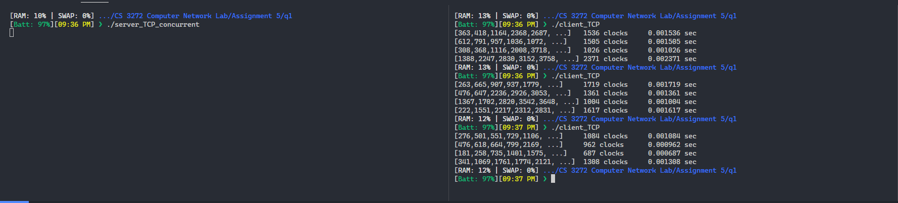
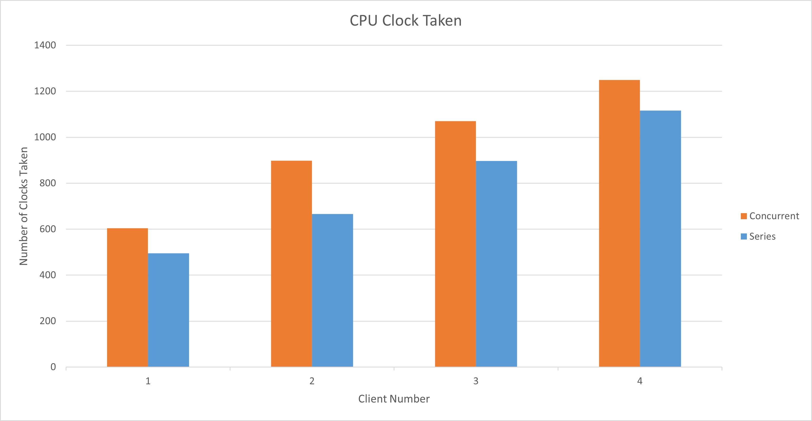
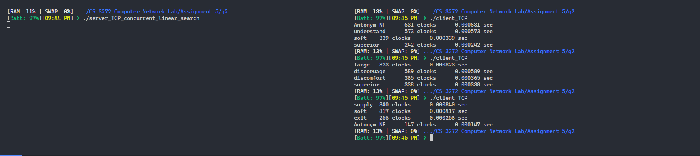

# Assignment 4

-   Name: Abhiroop Mukherjee
-   Roll No.: 510519109
-   GSuite: [510519109.abhirup@students.iiests.ac.in](mailto:510519109.abhirup@students.iiests.ac.in)
-   Subject: Computer Networks Lab (CS 3272)

# Question 1: Sorter

In this assignment, you have to use the sample codes to implement a TCP server that sorts an array of integers provided by the clients. Modify the client code such that it can input an array of integers to the server. Initially, develop an iterative version of this sorting server, which accepts the requests as an array of integers from the clients one- by-one and outputs back the sorted array. Increase the number
of clients from 1 to 4.

For each client request and response, measure the system time elapsed from the request submitted, and the result returned, and also find out the average CPU utilization. Next, you need to develop a concurrent sorting server that handles multiple simultaneous requests from four different clients. Measure the response time of the concurrent server at each client end and also the server’s average CPU utilization. What is your observation regarding the response time and CPU cycles engaged? Plot (using bar plot) the response times at each client under the iterative and concurrent scenarios.

Also, plot the CPU utilization at each server type.

<div style="page-break-after: always;"></div>

## Client Code

```c
/*				THE CLIENT PROCESS

    Please read the file server.c before you read this file. To run this,
    you must first change the IP address specified in the line:

        serv_addr.sin_addr.s_addr = inet_addr("127.0.0.1");

    to the IP-address of the machine where you are running the server.
*/

#include <stdio.h>
#include <stdlib.h>
#include <string.h>
#include <sys/types.h>
#include <sys/socket.h>
#include <netinet/in.h>
#include <arpa/inet.h>
#include <unistd.h>
#include <sys/time.h>
#include <pthread.h>

#define BUFSIZE 100
#define ARRSIZE 20
#define NUM_CONNECTIONS 4

void clearBuffer(char *buf, int size)
{
    for (int i = 0; i < size; i++)
        if (buf[i] == '\0')
            break;
        else
            buf[i] = '\0';
}

void *work(void *d)
{
    int sockfd;
    struct sockaddr_in serv_addr;

    char buf[BUFSIZE];

    /* Opening a socket is exactly similar to the server process */
    if ((sockfd = socket(AF_INET, SOCK_STREAM, 0)) < 0)
    {
        perror("Unable to create socket\n");
        exit(0);
    }

    /* Recall that we specified INADDR_ANY when we specified the server
       address in the server. Since the client can run on a different
       machine, we must specify the IP address of the server.

       TO RUN THIS CLIENT, YOU MUST CHANGE THE IP ADDRESS SPECIFIED
       BELOW TO THE IP ADDRESS OF THE MACHINE WHERE YOU ARE RUNNING
       THE SERVER.
    */
    serv_addr.sin_family = AF_INET;
    serv_addr.sin_addr.s_addr = inet_addr("127.0.0.1");
    serv_addr.sin_port = htons(6000);

    struct timeval start, end;
    gettimeofday(&start, NULL);

    /* With the information specified in serv_addr, the connect()
       system call establishes a connection with the server process.
    */
    if ((connect(sockfd, (struct sockaddr *)&serv_addr,
                 sizeof(serv_addr))) < 0)
    {
        perror("Unable to connect to server");
        exit(0);
    }

    /* After connection, the client can send or receive messages.
       However, please note that recv() will block when the
       server is not sending and vice versa. Similarly send() will
       block when the server is not receiving and vice versa. For
       non-blocking modes, refer to the online man pages.
    */
    // clearBuffer(buf, BUFSIZE);
    // recv(sockfd, buf, 100, 0);
    // printf("%s\n", buf);

    int data[ARRSIZE];
    for (int i = 0; i < ARRSIZE; i++)
        data[i] = rand() % 10000;

    clearBuffer(buf, BUFSIZE);
    strcpy(buf, "[");
    send(sockfd, buf, BUFSIZE, 0);

    for (int i = 0; i < ARRSIZE; i++)
    {
        clearBuffer(buf, BUFSIZE);
        sprintf(buf, "%d", data[i]);
        send(sockfd, buf, BUFSIZE, 0);
    }

    clearBuffer(buf, BUFSIZE);
    strcpy(buf, "]");
    send(sockfd, buf, BUFSIZE, 0);

    clock_t start_t = clock();

    int idx = 0;
    while (1)
    {

        clearBuffer(buf, BUFSIZE);

        recv(sockfd, buf, BUFSIZE, 0);

        if (strcmp(buf, "[") != 0 && strcmp(buf, "]") != 0)
        {
            data[idx++] = atoi(buf);
        }

        if (strcmp(buf, "]") == 0)
            break;
    }

    clock_t end_t = clock();

    printf("[%d,%d,%d,%d,%d, ...]", data[0], data[1], data[2], data[3], data[4]);

    long numCpuClocks = end_t - start_t;
    double total_t = (double)(end_t - start_t) / CLOCKS_PER_SEC;

    printf("\t%li clocks\t%lf sec\n", numCpuClocks, total_t);

    close(sockfd);
}

int main()
{
    srand(time(NULL));
    pthread_t tid[NUM_CONNECTIONS];

    for (int i = 0; i < NUM_CONNECTIONS; i++)
        pthread_create(&tid[i], NULL, work, NULL);

    for (int i = 0; i < NUM_CONNECTIONS; i++)
        pthread_join(tid[i], NULL);
}

```

<div style="page-break-after: always;"></div>

## Iterative Server Code

```c
/*
            NETWORK PROGRAMMING WITH SOCKETS

In this program we illustrate the use of Berkeley sockets for interprocess
communication across the network. We show the communication between a server
process and a client process.

Since many server processes may be running in a system, we identify the
desired server process by a "port number". Standard server processes have
a worldwide unique port number associated with it. For example, the port
number of SMTP (the sendmail process) is 25. To see a list of server
processes and their port numbers see the file /etc/services

In this program, we choose port number 6000 for our server process. Here we
shall demonstrate TCP connections only. For details and for other types of
connections see:

     Unix Network Programming
        -- W. Richard Stevens, Prentice Hall India.

To create a TCP server process, we first need to open a "socket" using the
socket() system call. This is similar to opening a file, and returns a socket
descriptor. The socket is then bound to the desired port number. After this
the process waits to "accept" client connections.

*/

#include <stdio.h>
#include <stdlib.h>
#include <string.h>
#include <sys/types.h>
#include <unistd.h>
#include <signal.h>

/* The following three files must be included for network programming */
#include <sys/socket.h>
#include <netinet/in.h>
#include <arpa/inet.h>

#define BUFSIZE 100
int sockfd, newsockfd; /* Socket descriptors */
#define ARRSIZE 20

/* THE SERVER PROCESS */

/* Compile this program with gcc server.c -o server
   and then execute it as ./server &
*/

void clearBuffer(char *buf, int size)
{
    for (int i = 0; i < size; i++)
        if (buf[i] == '\0')
            break;
        else
            buf[i] = '\0';
}

int int_comp(const void *a, const void *b)
{
    return *((int *)a) - *((int *)b);
}

void closeSock(int sig)
{
    close(sockfd);
    close(newsockfd);
    exit(0);
}

int main()
{
    signal(SIGINT, closeSock);

    struct sockaddr_in serv_addr;

    char buf[100]; /* We will use this buffer for communication */

    /* The following system call opens a socket. The first parameter
       indicates the family of the protocol to be followed. For internet
       protocols we use AF_INET. For TCP sockets the second parameter
       is SOCK_STREAM. The third parameter is set to 0 for user
       applications.
    */
    if ((sockfd = socket(AF_INET, SOCK_STREAM, 0)) < 0)
    {
        perror("Cannot create socket\n");
        kill(0, SIGINT);
    }

    /* The structure "sockaddr_in" is defined in <netinet/in.h> for the
       internet family of protocols. This has three main fields. The
       field "sin_family" specifies the family and is therefore AF_INET
       for the internet family. The field "sin_addr" specifies the
       internet address of the server. This field is set to INADDR_ANY
       for machines having a single IP address. The field "sin_port"
       specifies the port number of the server.
    */
    serv_addr.sin_family = AF_INET;
    serv_addr.sin_addr.s_addr = INADDR_ANY;
    serv_addr.sin_port = htons(6000);

    /* With the information provided in serv_addr, we associate the server
       with its port using the bind() system call.
    */
    if (bind(sockfd, (struct sockaddr *)&serv_addr, sizeof(serv_addr)) < 0)
    {
        perror("Unable to bind local address");
        kill(0, SIGINT);
    }

    listen(sockfd, 5); /* This specifies that up to 5 concurrent client
                  requests will be queued up while the system is
                  executing the "accept" system call below.
               */

    /* In this program we are illustrating an iterative server -- one
       which handles client connections one by one.i.e., no concurrency.
       The accept() system call returns a new socket descriptor
       which is used for communication with the server. After the
       communication is over, the process comes back to wait again on
       the original socket descriptor.
    */
    while (1)
    {

        /* The accept() system call accepts a client connection.
           It blocks the server until a client request comes.

           The accept() system call fills up the client's details
           in a struct sockaddr which is passed as a parameter.
           The length of the structure is noted in clilen. Note
           that the new socket descriptor returned by the accept()
           system call is stored in "newsockfd".
        */
        struct sockaddr_in cli_addr;
        int clilen = sizeof(cli_addr);
        newsockfd = accept(sockfd, (struct sockaddr *)&cli_addr,
                           &clilen);

        if (newsockfd < 0)
        {
            perror("Accept error");
            kill(0, SIGINT);
        }

        /* We initialize the buffer, copy the message to it,
            and send the message to the client.
        */
        // for (i = 0; i < 100; i++)
        //     buf[i] = '\0';
        // strcpy(buf, "Message from server");
        // send(newsockfd, buf, 100, 0);

        /* We again initialize the buffer, and receive a
            message from the client.
        */

        int arr[ARRSIZE];
        int idx = 0;

        while (1)
        {
            clearBuffer(buf, BUFSIZE);
            recv(newsockfd, buf, BUFSIZE, 0);
            if (strcmp(buf, "[") != 0 && strcmp(buf, "]") != 0)
            {
                arr[idx++] = atoi(buf);
            }

            if (strcmp(buf, "]") == 0)
                break;
        }

        qsort(arr, ARRSIZE, sizeof(int), int_comp);

        clearBuffer(buf, BUFSIZE);
        strcpy(buf, "[");

        send(newsockfd, buf, BUFSIZE, 0);

        for (int i = 0; i < ARRSIZE; i++)
        {
            clearBuffer(buf, BUFSIZE);
            sprintf(buf, "%d", arr[i]);

            send(newsockfd, buf, BUFSIZE, 0);
        }

        clearBuffer(buf, BUFSIZE);
        strcpy(buf, "]");
        send(newsockfd, buf, BUFSIZE, 0);

        close(newsockfd);
    }
}


```

<div style="page-break-after: always;"></div>

## Concurrent Server Code

```c
/*
            NETWORK PROGRAMMING WITH SOCKETS

In this program we illustrate the use of Berkeley sockets for interprocess
communication across the network. We show the communication between a server
process and a client process.

Since many server processes may be running in a system, we identify the
desired server process by a "port number". Standard server processes have
a worldwide unique port number associated with it. For example, the port
number of SMTP (the sendmail process) is 25. To see a list of server
processes and their port numbers see the file /etc/services

In this program, we choose port number 6000 for our server process. Here we
shall demonstrate TCP connections only. For details and for other types of
connections see:

     Unix Network Programming
        -- W. Richard Stevens, Prentice Hall India.

To create a TCP server process, we first need to open a "socket" using the
socket() system call. This is similar to opening a file, and returns a socket
descriptor. The socket is then bound to the desired port number. After this
the process waits to "accept" client connections.

*/

#include <stdio.h>
#include <stdlib.h>
#include <string.h>
#include <sys/types.h>
#include <unistd.h>
#include <signal.h>

/* The following three files must be included for network programming */
#include <sys/socket.h>
#include <netinet/in.h>
#include <arpa/inet.h>

#define BUFSIZE 100
int sockfd, newsockfd; /* Socket descriptors */
#define ARRSIZE 20

/* THE SERVER PROCESS */

/* Compile this program with gcc server.c -o server
   and then execute it as ./server &
*/

void clearBuffer(char *buf, int size)
{
    for (int i = 0; i < size; i++)
        if (buf[i] == '\0')
            break;
        else
            buf[i] = '\0';
}

int int_comp(const void *a, const void *b)
{
    return *((int *)a) - *((int *)b);
}

void closeSock(int sig)
{
    close(sockfd);
    close(newsockfd);
    exit(0);
}

int main()
{
    signal(SIGINT, closeSock);

    struct sockaddr_in serv_addr;

    char buf[100]; /* We will use this buffer for communication */

    /* The following system call opens a socket. The first parameter
       indicates the family of the protocol to be followed. For internet
       protocols we use AF_INET. For TCP sockets the second parameter
       is SOCK_STREAM. The third parameter is set to 0 for user
       applications.
    */
    if ((sockfd = socket(AF_INET, SOCK_STREAM, 0)) < 0)
    {
        perror("Cannot create socket\n");
        kill(0, SIGINT);
    }

    /* The structure "sockaddr_in" is defined in <netinet/in.h> for the
       internet family of protocols. This has three main fields. The
       field "sin_family" specifies the family and is therefore AF_INET
       for the internet family. The field "sin_addr" specifies the
       internet address of the server. This field is set to INADDR_ANY
       for machines having a single IP address. The field "sin_port"
       specifies the port number of the server.
    */
    serv_addr.sin_family = AF_INET;
    serv_addr.sin_addr.s_addr = INADDR_ANY;
    serv_addr.sin_port = htons(6000);

    /* With the information provided in serv_addr, we associate the server
       with its port using the bind() system call.
    */
    if (bind(sockfd, (struct sockaddr *)&serv_addr, sizeof(serv_addr)) < 0)
    {
        perror("Unable to bind local address");
        kill(0, SIGINT);
    }

    listen(sockfd, 5); /* This specifies that up to 5 concurrent client
                  requests will be queued up while the system is
                  executing the "accept" system call below.
               */

    /* In this program we are illustrating an iterative server -- one
       which handles client connections one by one.i.e., no concurrency.
       The accept() system call returns a new socket descriptor
       which is used for communication with the server. After the
       communication is over, the process comes back to wait again on
       the original socket descriptor.
    */
    while (1)
    {

        /* The accept() system call accepts a client connection.
           It blocks the server until a client request comes.

           The accept() system call fills up the client's details
           in a struct sockaddr which is passed as a parameter.
           The length of the structure is noted in clilen. Note
           that the new socket descriptor returned by the accept()
           system call is stored in "newsockfd".
        */
        struct sockaddr_in cli_addr;
        int clilen = sizeof(cli_addr);
        newsockfd = accept(sockfd, (struct sockaddr *)&cli_addr,
                           &clilen);

        if (newsockfd < 0)
        {
            perror("Accept error");
            kill(0, SIGINT);
        }

        /* We initialize the buffer, copy the message to it,
            and send the message to the client.
        */
        // for (i = 0; i < 100; i++)
        //     buf[i] = '\0';
        // strcpy(buf, "Message from server");
        // send(newsockfd, buf, 100, 0);

        /* We again initialize the buffer, and receive a
            message from the client.
        */

        if (fork() == 0)
        {
            int arr[ARRSIZE];
            int idx = 0;

            while (1)
            {
                clearBuffer(buf, BUFSIZE);
                recv(newsockfd, buf, BUFSIZE, 0);
                if (strcmp(buf, "[") != 0 && strcmp(buf, "]") != 0)
                {
                    arr[idx++] = atoi(buf);
                }

                if (strcmp(buf, "]") == 0)
                    break;
            }

            qsort(arr, ARRSIZE, sizeof(int), int_comp);

            clearBuffer(buf, BUFSIZE);
            strcpy(buf, "[");

            send(newsockfd, buf, BUFSIZE, 0);

            for (int i = 0; i < ARRSIZE; i++)
            {
                clearBuffer(buf, BUFSIZE);
                sprintf(buf, "%d", arr[i]);

                send(newsockfd, buf, BUFSIZE, 0);
            }

            clearBuffer(buf, BUFSIZE);
            strcpy(buf, "]");
            send(newsockfd, buf, BUFSIZE, 0);
        }

        close(newsockfd);
    }
}

```

<div style="page-break-after: always;"></div>

## Screenshots



## Bar Plots

### Comparing RTT concurrent vs Iterative Server


<div style="page-break-after: always;"></div>

### Comparing CPU Utilization concurrent vs iterative server



## Conclusion

-   Concurrent server in general, took less time to execute than iterative server.
-   However, the CPU utilization for concurrent server is higher than that of iterative server.

<div style="page-break-after: always;"></div>

# Question 2: Vocabs

The objective of this programming assignment is to make use of the sample codes and implement an online vocabulary service on two concurrent TCP servers. These servers take words as input from four clients at the same time and respond with the corresponding antonyms. E.g., if the client gives as input “top,” the server responds with “bottom.” If the input word is not present, the server should return an error message “Sorry, antonym not found.”

You need to maintain a lookup table at the server side (implementation of the lookup table is your choice), which contains a list of predefined words and the corresponding antonyms. The first server searches the input word in the lookup table row-by-row and gives back the result (i.e., either the antonym or the error message). The second server should alphabetically sort the lookup table according to the words as a pre-processing, perform a binary search, and returns the result. Measure the response times from both the concurrent servers and write your observations regarding their performances.

## Client Code

```c
#include <stdio.h>
#include <stdlib.h>
#include <string.h>
#include <sys/types.h>
#include <sys/socket.h>
#include <netinet/in.h>
#include <arpa/inet.h>
#include <unistd.h>
#include <sys/time.h>
#include <pthread.h>

#define BUFSIZE 100
#define NUM_CONNECTIONS 4

char *inputs[] = {
    "absence"
    "admit",
    "beginning",
    "borrow",
    "comfort",
    "courage",
    "dark",
    "demand",
    "encourage",
    "entrance",
    "fail",
    "foolish",
    "gloomy",
    "giant",
    "happy",
    "healthy",
    "immense",
    "inferior",
    "justice",
    "knowldge",
    "lazy",
    "little",
    "misunderstand",
    "possible",
    "prudent",
    "rapid",
    "rigid",
    "satisfactory",
    "scatter",
    "aedesdtc"};

const int INPUT_SIZE = 29;

void clearBuffer(char *buf, int size)
{
    for (int i = 0; i < size; i++)
        if (buf[i] == '\0')
            break;
        else
            buf[i] = '\0';
}

void *work(void *d)
{
    int sockfd;
    struct sockaddr_in serv_addr;

    char buf[BUFSIZE];

    /* Opening a socket is exactly similar to the server process */
    if ((sockfd = socket(AF_INET, SOCK_STREAM, 0)) < 0)
    {
        perror("Unable to create socket\n");
        exit(0);
    }

    serv_addr.sin_family = AF_INET;
    serv_addr.sin_addr.s_addr = inet_addr("127.0.0.1");
    serv_addr.sin_port = htons(6000);

    struct timeval start, end;
    gettimeofday(&start, NULL);

    /* With the information specified in serv_addr, the connect()
       system call establishes a connection with the server process.
    */
    if ((connect(sockfd, (struct sockaddr *)&serv_addr, sizeof(serv_addr))) < 0)
    {
        perror("Unable to connect to server");
        exit(0);
    }

    /* After connection, the client can send or receive messages.
       However, please note that recv() will block when the
       server is not sending and vice versa. Similarly send() will
       block when the server is not receiving and vice versa. For
       non-blocking modes, refer to the online man pages.
    */
    // clearBuffer(buf, BUFSIZE);
    // recv(sockfd, buf, 100, 0);
    // printf("%s\n", buf);

    clearBuffer(buf, BUFSIZE);
    strcpy(buf, inputs[rand() % INPUT_SIZE]);

    // printf("%s -> \t", buf);
    send(sockfd, buf, BUFSIZE, 0);
    // printf("sent data\n");

    clock_t start_t = clock();

    // printf("waiting to recieve data\n");
    clearBuffer(buf, BUFSIZE);
    recv(sockfd, buf, BUFSIZE, 0);
    // printf("%s", buf);

    clock_t end_t = clock();

    long numCpuClocks = end_t - start_t;
    double total_t = (double)(end_t - start_t) / CLOCKS_PER_SEC;

    printf("%s\t%li clocks\t%lf sec\n", buf,numCpuClocks, total_t);

    close(sockfd);
}

int main()
{
    srand(time(NULL));
    pthread_t tid[NUM_CONNECTIONS];

    for (int i = 0; i < NUM_CONNECTIONS; i++)
        pthread_create(&tid[i], NULL, work, NULL);

    for (int i = 0; i < NUM_CONNECTIONS; i++)
        pthread_join(tid[i], NULL);
}

```

<div style="page-break-after: always;"></div>

## Server with Linear Search

```c
/*
            NETWORK PROGRAMMING WITH SOCKETS

In this program we illustrate the use of Berkeley sockets for interprocess
communication across the network. We show the communication between a server
process and a client process.

Since many server processes may be running in a system, we identify the
desired server process by a "port number". Standard server processes have
a worldwide unique port number associated with it. For example, the port
number of SMTP (the sendmail process) is 25. To see a list of server
processes and their port numbers see the file /etc/services

In this program, we choose port number 6000 for our server process. Here we
shall demonstrate TCP connections only. For details and for other types of
connections see:

     Unix Network Programming
        -- W. Richard Stevens, Prentice Hall India.

To create a TCP server process, we first need to open a "socket" using the
socket() system call. This is similar to opening a file, and returns a socket
descriptor. The socket is then bound to the desired port number. After this
the process waits to "accept" client connections.

*/

#include <stdio.h>
#include <stdlib.h>
#include <string.h>
#include <sys/types.h>
#include <unistd.h>
#include <signal.h>

/* The following three files must be included for network programming */
#include <sys/socket.h>
#include <netinet/in.h>
#include <arpa/inet.h>

#define BUFSIZE 100
int sockfd, newsockfd; /* Socket descriptors */
#define ARRSIZE 20

/* THE SERVER PROCESS */

/* Compile this program with gcc server.c -o server
   and then execute it as ./server &
*/

char *ANTONYMS[][2] = {
    {"absence", "presence"},
    {"admit", "deny"},
    {"beginning", "ending"},
    {"borrow", "lend"},
    {"comfort", "discomfort"},
    {"courage", "cowardice"},
    {"dark", "light"},
    {"demand", "supply"},
    {"encourage", "discoruage"},
    {"entrance", "exit"},
    {"fail", "succeed"},
    {"foolish", "wise"},
    {"gloomy", "cheerful"},
    {"giant", "dwarf"},
    {"happy", "sad"},
    {"healthy", "unhealthy"},
    {"immense", "tiny"},
    {"inferior", "superior"},
    {"justice", "injustice"},
    {"knowldge", "ignorance"},
    {"lazy", "energetic"},
    {"little", "large"},
    {"misunderstand", "understand"},
    {"possible", "impossible"},
    {"prudent", "imprudent"},
    {"rapid", "slow"},
    {"rigid", "soft"},
    {"satisfactory", "unsatisfactory"},
    {"scatter", "collect"},
};
const int ANTONYM_SIZE = 28;

int linearSearch(char *key)
{
   for (int i = 0; i < ANTONYM_SIZE; i++)
      if (strcmp(ANTONYMS[i][0], key) == 0)
         return i;

   return -1;
}

void clearBuffer(char *buf, int size)
{
   for (int i = 0; i < size; i++)
      if (buf[i] == '\0')
         break;
      else
         buf[i] = '\0';
}

void closeSock(int sig)
{
   close(sockfd);
   close(newsockfd);
   exit(0);
}

int main()
{
   signal(SIGINT, closeSock);

   struct sockaddr_in serv_addr;

   char buf[100]; /* We will use this buffer for communication */

   /* The following system call opens a socket. The first parameter
      indicates the family of the protocol to be followed. For internet
      protocols we use AF_INET. For TCP sockets the second parameter
      is SOCK_STREAM. The third parameter is set to 0 for user
      applications.
   */
   if ((sockfd = socket(AF_INET, SOCK_STREAM, 0)) < 0)
   {
      perror("Cannot create socket\n");
      kill(0, SIGINT);
   }

   /* The structure "sockaddr_in" is defined in <netinet/in.h> for the
      internet family of protocols. This has three main fields. The
      field "sin_family" specifies the family and is therefore AF_INET
      for the internet family. The field "sin_addr" specifies the
      internet address of the server. This field is set to INADDR_ANY
      for machines having a single IP address. The field "sin_port"
      specifies the port number of the server.
   */
   serv_addr.sin_family = AF_INET;
   serv_addr.sin_addr.s_addr = INADDR_ANY;
   serv_addr.sin_port = htons(6000);

   /* With the information provided in serv_addr, we associate the server
      with its port using the bind() system call.
   */
   if (bind(sockfd, (struct sockaddr *)&serv_addr, sizeof(serv_addr)) < 0)
   {
      perror("Unable to bind local address");
      kill(0, SIGINT);
   }

   listen(sockfd, 5); /* This specifies that up to 5 concurrent client
                 requests will be queued up while the system is
                 executing the "accept" system call below.
              */

   /* In this program we are illustrating an iterative server -- one
      which handles client connections one by one.i.e., no concurrency.
      The accept() system call returns a new socket descriptor
      which is used for communication with the server. After the
      communication is over, the process comes back to wait again on
      the original socket descriptor.
   */
   while (1)
   {

      /* The accept() system call accepts a client connection.
         It blocks the server until a client request comes.

         The accept() system call fills up the client's details
         in a struct sockaddr which is passed as a parameter.
         The length of the structure is noted in clilen. Note
         that the new socket descriptor returned by the accept()
         system call is stored in "newsockfd".
      */
      struct sockaddr_in cli_addr;
      int clilen = sizeof(cli_addr);
      newsockfd = accept(sockfd, (struct sockaddr *)&cli_addr,
                         &clilen);

      if (newsockfd < 0)
      {
         perror("Accept error");
         kill(0, SIGINT);
      }

      if (fork() == 0)
      {
         clearBuffer(buf, BUFSIZE);
         printf("waiting to receive data\n");
         recv(newsockfd, buf, BUFSIZE, 0);

         printf("received data %s\n", buf);

         int idx = linearSearch(buf);

         clearBuffer(buf, BUFSIZE);
         if (idx == -1)
            strcpy(buf, "Antonym NF");
         else
            strcpy(buf, ANTONYMS[idx][1]);

         printf("sending data %s\n", buf);
         send(newsockfd, buf, BUFSIZE, 0);
         printf("data sent");
      }

      close(newsockfd);
   }
}

```

<div style="page-break-after: always;"></div>

## Server with Binary Search

```c
/*
            NETWORK PROGRAMMING WITH SOCKETS

In this program we illustrate the use of Berkeley sockets for interprocess
communication across the network. We show the communication between a server
process and a client process.

Since many server processes may be running in a system, we identify the
desired server process by a "port number". Standard server processes have
a worldwide unique port number associated with it. For example, the port
number of SMTP (the sendmail process) is 25. To see a list of server
processes and their port numbers see the file /etc/services

In this program, we choose port number 6000 for our server process. Here we
shall demonstrate TCP connections only. For details and for other types of
connections see:

     Unix Network Programming
        -- W. Richard Stevens, Prentice Hall India.

To create a TCP server process, we first need to open a "socket" using the
socket() system call. This is similar to opening a file, and returns a socket
descriptor. The socket is then bound to the desired port number. After this
the process waits to "accept" client connections.

*/

#include <stdio.h>
#include <stdlib.h>
#include <string.h>
#include <sys/types.h>
#include <unistd.h>
#include <signal.h>

/* The following three files must be included for network programming */
#include <sys/socket.h>
#include <netinet/in.h>
#include <arpa/inet.h>

#define BUFSIZE 100
int sockfd, newsockfd; /* Socket descriptors */
#define ARRSIZE 20

/* THE SERVER PROCESS */

/* Compile this program with gcc server.c -o server
   and then execute it as ./server &
*/

char *ANTONYMS[][2] = {
    {"absence", "presence"},
    {"admit", "deny"},
    {"beginning", "ending"},
    {"borrow", "lend"},
    {"comfort", "discomfort"},
    {"courage", "cowardice"},
    {"dark", "light"},
    {"demand", "supply"},
    {"encourage", "discoruage"},
    {"entrance", "exit"},
    {"fail", "succeed"},
    {"foolish", "wise"},
    {"gloomy", "cheerful"},
    {"giant", "dwarf"},
    {"happy", "sad"},
    {"healthy", "unhealthy"},
    {"immense", "tiny"},
    {"inferior", "superior"},
    {"justice", "injustice"},
    {"knowldge", "ignorance"},
    {"lazy", "energetic"},
    {"little", "large"},
    {"misunderstand", "understand"},
    {"possible", "impossible"},
    {"prudent", "imprudent"},
    {"rapid", "slow"},
    {"rigid", "soft"},
    {"satisfactory", "unsatisfactory"},
    {"scatter", "collect"},
};
const int ANTONYM_SIZE = 28;

// int linearSearch(char *key)
// {
//    for (int i = 0; i < ANTONYM_SIZE; i++)
//       if (strcmp(ANTONYMS[i][0], key) == 0)
//          return i;

//    return -1;
// }

int binarySearch(char *key)
{
   int left = 0;
   int right = ANTONYM_SIZE - 1;

   while (left <= right)
   {
      int mid = left + (right - left) / 2;

      int res = strcmp(key, ANTONYMS[mid][0]);

      if (res == 0)
         return mid;
      else if (res < 0) // key < ANTONYM[mid] -> make mid go left
         right = mid - 1;
      else
         left = mid + 1;
   }

   return -1;
}

void clearBuffer(char *buf, int size)
{
   for (int i = 0; i < size; i++)
      if (buf[i] == '\0')
         break;
      else
         buf[i] = '\0';
}

void closeSock(int sig)
{
   close(sockfd);
   close(newsockfd);
   exit(0);
}

int main()
{
   signal(SIGINT, closeSock);

   struct sockaddr_in serv_addr;

   char buf[100]; /* We will use this buffer for communication */

   /* The following system call opens a socket. The first parameter
      indicates the family of the protocol to be followed. For internet
      protocols we use AF_INET. For TCP sockets the second parameter
      is SOCK_STREAM. The third parameter is set to 0 for user
      applications.
   */
   if ((sockfd = socket(AF_INET, SOCK_STREAM, 0)) < 0)
   {
      perror("Cannot create socket\n");
      kill(0, SIGINT);
   }

   /* The structure "sockaddr_in" is defined in <netinet/in.h> for the
      internet family of protocols. This has three main fields. The
      field "sin_family" specifies the family and is therefore AF_INET
      for the internet family. The field "sin_addr" specifies the
      internet address of the server. This field is set to INADDR_ANY
      for machines having a single IP address. The field "sin_port"
      specifies the port number of the server.
   */
   serv_addr.sin_family = AF_INET;
   serv_addr.sin_addr.s_addr = INADDR_ANY;
   serv_addr.sin_port = htons(6000);

   /* With the information provided in serv_addr, we associate the server
      with its port using the bind() system call.
   */
   if (bind(sockfd, (struct sockaddr *)&serv_addr, sizeof(serv_addr)) < 0)
   {
      perror("Unable to bind local address");
      kill(0, SIGINT);
   }

   listen(sockfd, 5); /* This specifies that up to 5 concurrent client
                 requests will be queued up while the system is
                 executing the "accept" system call below.
              */

   /* In this program we are illustrating an iterative server -- one
      which handles client connections one by one.i.e., no concurrency.
      The accept() system call returns a new socket descriptor
      which is used for communication with the server. After the
      communication is over, the process comes back to wait again on
      the original socket descriptor.
   */
   while (1)
   {

      /* The accept() system call accepts a client connection.
         It blocks the server until a client request comes.

         The accept() system call fills up the client's details
         in a struct sockaddr which is passed as a parameter.
         The length of the structure is noted in clilen. Note
         that the new socket descriptor returned by the accept()
         system call is stored in "newsockfd".
      */
      struct sockaddr_in cli_addr;
      int clilen = sizeof(cli_addr);
      newsockfd = accept(sockfd, (struct sockaddr *)&cli_addr,
                         &clilen);

      if (newsockfd < 0)
      {
         perror("Accept error");
         kill(0, SIGINT);
      }

      /* We initialize the buffer, copy the message to it,
          and send the message to the client.
      */
      // for (i = 0; i < 100; i++)
      //     buf[i] = '\0';
      // strcpy(buf, "Message from server");
      // send(newsockfd, buf, 100, 0);

      /* We again initialize the buffer, and receive a
          message from the client.
      */

      if (fork() == 0)
      {
         clearBuffer(buf, BUFSIZE);
         printf("waiting to receive data\n");
         recv(newsockfd, buf, BUFSIZE, 0);

         printf("received data %s\n", buf);

         int idx = binarySearch(buf);

         clearBuffer(buf, BUFSIZE);
         if (idx == -1)
            strcpy(buf, "Antonym NF");
         else
            strcpy(buf, ANTONYMS[idx][1]);

         printf("sending data %s\n", buf);
         send(newsockfd, buf, BUFSIZE, 0);
         printf("data sent");
      }

      close(newsockfd);
   }
}

```

<div style="page-break-after: always;"></div>

## Screenshots



## Bar Plot


## Conclusion

As we can see, binary search is expected to usually take less time than linear search (we do not consider the time taken to sort the list of words).
