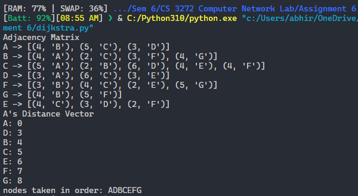

# Assignment 4

-   Name: Abhiroop Mukherjee
-   Roll No.: 510519109
-   GSuite: [510519109.abhirup@students.iiests.ac.in](mailto:510519109.abhirup@students.iiests.ac.in)
-   Subject: Computer Networks Lab (CS 3272)

# 1. Link State Routing

Implement the Dijkstra’s algorithm (LS routing) to find the shortest path tree and the forwarding table for node A in the given network. To find the complexity of Dijkstra’s algorithm, find the number of searches we have to do to find the shortest path for a single node when the number of nodes is n.


<!-- <div style="page-break-after: always;"></div> -->

## Code

```python
class UndirectedGraph:
    def __init__(self) -> None:
        self.edges = dict()

    def add_edge(self,
                 initial_node: str,
                 final_node: str,
                 edge_wt: int) -> None:
        self.edges.setdefault(initial_node, []).append((edge_wt, final_node))
        self.edges.setdefault(final_node, []).append((edge_wt, initial_node))

    def __str__(self) -> str:
        for (key, value) in self.edges.items():
            print(f"{key} -> {value}")
        return ""

    def print_adjacency_matrix(self):
        self.__str__()

    def dijkstra(self, initial_node: str) -> dict:
        # import heap stuffs
        from heapq import heappush, heappop

        if initial_node not in self.edges.keys():
            raise Exception("Initial node not in graph")

        # initialization
        # visited_nodes = {initial_node}
        distance_vector = {initial_node: 0}
        heap = []

        # add neighboring edges of the initial node to the heap
        for (edge_wt, node_adj_to_initial_node) in self.edges[initial_node]:
            heappush(heap, (edge_wt, node_adj_to_initial_node))

        # loop part of the specified algo
        while len(distance_vector.keys()) != len(self.edges.keys()):

            # find  minimum edge which has node not in the visited_nodes
            while True:
                if len(heap) == 0:
                    raise Exception("Heap is empty when it should not be")
                min_edge_wt, min_edge_node = heappop(heap)
                if min_edge_node not in distance_vector.keys():
                    break

            # this min_edge is greedily selected and is reflected to the
            # return values
            distance_vector[min_edge_node] = min_edge_wt

            # add all the neighboring edges wrt current min_node to the heap
            for (edge_wt,
                 node_adj_to_min_edge_node) in self.edges[min_edge_node]:
                heappush(
                    heap,
                    (min_edge_wt + edge_wt,  node_adj_to_min_edge_node)
                )

        return distance_vector


def test_dijkstra_algo():
    undirected_graph = UndirectedGraph()
    undirected_graph.add_edge('A', 'B', 4)
    undirected_graph.add_edge('A', 'C', 5)
    undirected_graph.add_edge('A', 'D', 3)
    undirected_graph.add_edge('B', 'C', 2)
    undirected_graph.add_edge('B', 'F', 3)
    undirected_graph.add_edge('B', 'G', 4)
    undirected_graph.add_edge('C', 'D', 6)
    undirected_graph.add_edge('C', 'E', 4)
    undirected_graph.add_edge('C', 'F', 4)
    undirected_graph.add_edge('D', 'E', 3)
    undirected_graph.add_edge('E', 'F', 2)
    undirected_graph.add_edge('F', 'G', 5)

    print("Adjacency Matrix")
    undirected_graph.print_adjacency_matrix()

    distance_vector = undirected_graph.dijkstra('A')

    print("A's Distance Vector")
    for key, value in distance_vector.items():
        print(f"{key}: {value}")

    nodes_taken = "".join(distance_vector.keys())
    print(f"nodes taken in order: {nodes_taken}")


if __name__ == "__main__":
    test_dijkstra_algo()
```

## Screenshot



## Time Complexity Analysis

For a graph _G = (V, E)_:

1. It takes _O(|V|)_ time to construct the initial priority queue of _|V|_ vertices
2. With adjacency list representation, all vertices of the graph can be traversed using BFS. Therefore, iterating over all vertices’ neighbors and updating their _dist_ values over the course of a run of the algorithm takes _O(|E|)_ time.
3. The time taken for each iteration of the loop is _O(|V|)_, as one vertex is removed from _G_ per loop.
4. The binary heap data structure allows us to extract-min (remove the node with minimal _dist_) and update an element (recalculate _dist[u]_) in _O(log|V|)_ time.
5. Therefore, the time complexity becomes _O(|V|) + O(|E| * log|V|) + O(|V| * log|V|)_, which is _O((|E|+|V|) * log|V|) = O(|E| * log|V|)_, since _|E| >= |V| - 1_ as G is a connected graph.

<div style="page-break-after: always;"></div>

# 2. Distance Vector Routing

Consider the network shown below, and assume that each node initially knows the cost of each of its neighbors. Implement the Bellman-Ford’s algorithm (DV routing) and run simulation for a predefined time period. Output the distance-table entries for every node at regular intervals till the end of simulation. Check if convergence has been achieved or not. If not, increment the simulation duration and make successive attempts to achieve convergence.


## Code

```python
class Router:
    def __init__(self, router_name: str) -> None:
        # key is router name and value is the distance vector from it,
        # this will keep on changing
        # key not present means that distance from self to other router in inf
        self.__distance_vector = {router_name: 0}
        # key is a string and value is the dist from it,
        # this will most probably be same
        self.__neighbors = dict()
        self.__router_name = router_name

    def add_neighbor(self, other_router_name: str, dist: int) -> None:
        # if other_router_name already present,
        # set minimum of already present value else set dist
        self.__neighbors[other_router_name] = dist \
            if other_router_name not in self.__neighbors.keys() \
            else min(dist,  self.__neighbors[other_router_name])

        self.__distance_vector[other_router_name] = dist \
            if other_router_name not in self.__distance_vector.keys() \
            else min(dist, self.__distance_vector[other_router_name])

    def update_dv(
            self,
            other_router_name: str,
            other_distance_vector: dict[str, int],
            verbose=False) -> None:

        if other_router_name == self.__router_name:
            return

        if other_router_name not in self.__neighbors.keys():
            raise Exception("error: got distance vector from non neighbor")

        if verbose:
            print(
                f"{other_router_name} gave {other_distance_vector}"
                f" to {self.__router_name}, edge dist ="
                f" {self.__neighbors[other_router_name]}")

            print(f"initial dv: {self.__distance_vector}")

        for key, value in other_distance_vector.items():
            self.__distance_vector[key] =\
                value + self.__neighbors[other_router_name] \
                if key not in self.__distance_vector.keys() \
                else min(self.__distance_vector[key],
                         value + self.__neighbors[other_router_name]
                         )

        if verbose:
            print(f"updated dv: {self.__distance_vector}")
            print()

    def get_distance_vector(self) -> dict[str, int]:
        return self.__distance_vector

    def get_neighbors(self) -> dict[str: int]:
        return self.__neighbors

    def print_distance_vector(self) -> None:
        print(f"{self.__router_name} ->", end="")
        print(" { ", end="")
        for key, value in sorted(
            self.__distance_vector.items(), key=lambda x: x[0]
        ):
            print(f"{key}: {value}, ", end="")
        print("}")


class UndirectedNetwork:
    def __init__(self) -> None:
        # key is router name and the value is a router object
        self.__routers = dict()

    def add_edge(self, initial_router_name: str,
                 final_router_name: str,
                 link_weight: int) -> None:

        if initial_router_name == final_router_name:
            return

        self.__routers.setdefault(
            initial_router_name,
            Router(router_name=initial_router_name)
        ).add_neighbor(final_router_name, link_weight)

        self.__routers.setdefault(
            final_router_name,
            Router(router_name=final_router_name)
        ).add_neighbor(initial_router_name, link_weight)

    def share_distance_vector(
            self,
            sender_router_name: str,
            receiver_router_name: str) -> None:

        if sender_router_name not in self.__routers.keys():
            raise Exception('error: sender router name invalid')

        if receiver_router_name not in self.__routers.keys():
            raise Exception('error: receiver router name invalid')

        self.__routers[receiver_router_name].update_dv(
            sender_router_name,
            self.__routers[sender_router_name].get_distance_vector()
        )

    def print_distance_vectors(self) -> None:
        for _, value in sorted(self.__routers.items(), key=lambda x: x[0]):
            value.print_distance_vector()

    def distance_vector_routing(self, num_iter: int):
        for num in range(num_iter):
            print(f"iter {num}:")
            for router_name, router in self.__routers.items():
                for neighbor_name in router.get_neighbors().keys():
                    self.share_distance_vector(
                        router_name, neighbor_name
                    )
            self.print_distance_vectors()


def distance_vector():
    network = UndirectedNetwork()

    network.add_edge("u", "v", 1)
    network.add_edge("u", "y", 2)
    network.add_edge("v", "x", 3)
    network.add_edge("v", "z", 6)
    network.add_edge("x", "y", 3)
    network.add_edge("x", "z", 2)

    network.distance_vector_routing(num_iter=3)


if __name__ == "__main__":
    distance_vector()

```

## Screenshots


