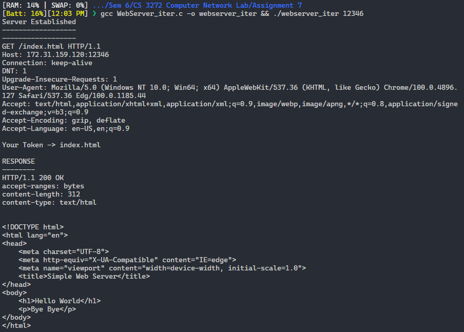
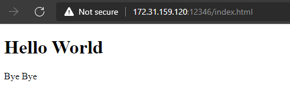
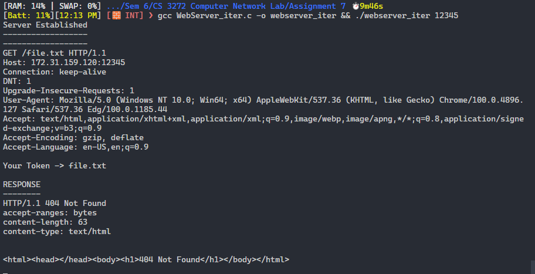
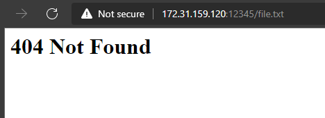
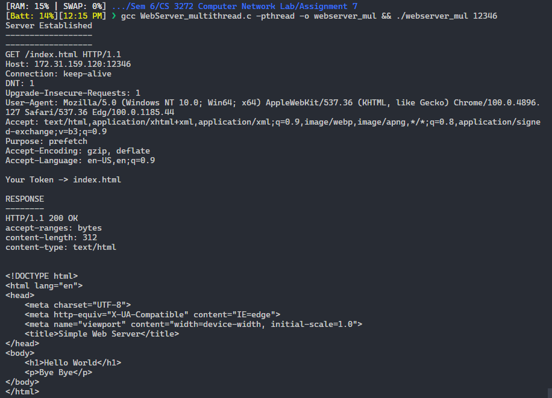
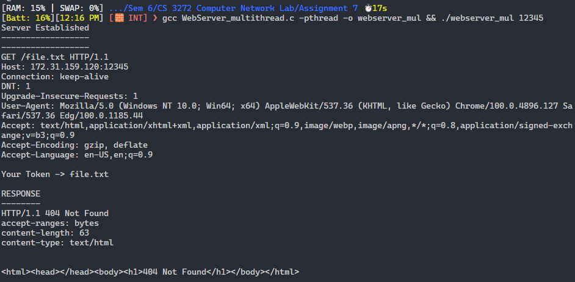

# Assignment 7

-   Name: Abhiroop Mukherjee
-   Roll No.: 510519109
-   GSuite: [510519109.abhirup@students.iiests.ac.in](mailto:510519109.abhirup@students.iiests.ac.in)
-   Subject: Computer Networks Lab (CS 3272)

# A: Simple Web Server

In this assignment, you will develop a simple Web server in C that is capable of processing only one HTTP request at a time. Specifically, your Web server will

1. create a TCP connection socket when contacted by a client (browser)
2. receive the HTTP request from this connection
3. parse the request to determine the specific file being requested
4. get the requested file from the server’s file system
5. create an HTTP response message consisting of the requested file preceded by header lines
6. send the response over the TCP connection to the requesting browser. If a browser requests a file that is not present in your server, your server should return a “404 Not Found” error message

## HTML code (`./index.html`)

```html
<!DOCTYPE html>
<html lang="en">
    <head>
        <meta charset="UTF-8" />
        <meta http-equiv="X-UA-Compatible" content="IE=edge" />
        <meta name="viewport" content="width=device-width, initial-scale=1.0" />
        <title>Simple Web Server</title>
    </head>
    <body>
        <h1>Hello World</h1>
        <p>Bye Bye</p>
    </body>
</html>
```

<div style="page-break-after: always;"></div>

## Server Code

```c
// Web Server Code

#include <stdio.h>
#include <stdlib.h>
#include <string.h>
#include <sys/types.h>
#include <sys/socket.h>
#include <netinet/in.h>
#include <arpa/inet.h>
#include <unistd.h>

void talk(int newsockfd)
{
	char buf[1000];

	for (int i = 0; i < 1000; i++)
		buf[i] = '\0';

	recv(newsockfd, buf, 2500, 0);
	printf("Server Established\n------------------\n------------------\n%s", buf);

	char *token = strtok(buf, "/");
	token = strtok(NULL, " ");
	printf("Your Token -> %s\n", token);
	FILE *fp = fopen(token, "r");

	if (!fp)
	{
		// printf("File doesn't exist in Server Directory.\n");
		printf("\nRESPONSE\n--------\n");

		char header[1000];
		char data[1000] = "<html><head></head><body><h1>404 Not Found</h1></body></html>\r\n";

		sprintf(header, "HTTP/1.1 404 Not Found\naccept-ranges: bytes\ncontent-length: %ld\ncontent-type: text/html\r\n\r\n", strlen(data));
		printf("%s\n", header);
		send(newsockfd, header, strlen(header) * sizeof(char), 0);

		printf("%s\n", data);
		send(newsockfd, data, strlen(data) * sizeof(char), 0);

		close(newsockfd);
	}
	else
	{

		// printf("File exists in Server Directory\n");
		printf("\nRESPONSE\n--------\n");

		char header[1000];
		char data[10000];
		size_t charRead = fread(data, sizeof(char), 10000, fp);

		sprintf(header, "HTTP/1.1 200 OK\naccept-ranges: bytes\ncontent-length: %ld\ncontent-type: text/html\r\n\r\n", strlen(data));
		printf("%s\n", header);
		send(newsockfd, header, strlen(header) * sizeof(char), 0);

		printf("%s\n", data);
		send(newsockfd, data, charRead, 0);
		send(newsockfd, "\r\n", sizeof("\r\n"), 0);

		close(newsockfd);
	}
}

int main(int argc, char *argv[])
{
	int sockfd, newsockfd;
	int clilen;
	struct sockaddr_in cli_addr, serv_addr;

	if ((sockfd = socket(AF_INET, SOCK_STREAM, 0)) < 0)
	{
		printf("Cannot create socket\n");
		exit(0);
	}

	int port = atoi(argv[1]);
	serv_addr.sin_family = AF_INET;
	serv_addr.sin_addr.s_addr = INADDR_ANY;
	serv_addr.sin_port = htons(port);

	if (bind(sockfd, (struct sockaddr *)&serv_addr, sizeof(serv_addr)) < 0)
	{
		printf("Unable to bind local address\n");
		exit(0);
	}

	listen(sockfd, 5);
	while (1)
	{

		clilen = sizeof(cli_addr);
		newsockfd = accept(sockfd, (struct sockaddr *)&cli_addr, &clilen);

		if (newsockfd < 0)
		{
			printf("Accept error\n");
			exit(0);
		}
		talk(newsockfd);
	}
	close(sockfd);
}

```

## Observation

### 1. when valid file exists

In console (server) side we get the info of the HTTP GET request by the browser and we see that the file is present and is sent back to the browser


In browser side we can see the webpage



<div style="page-break-after: always;"></div>

### 2. when file does not exist

In console (server) side we get the info of the HTTP GET request by the browser and we see that file is not present, hence the webserver is giving the "404 Not Found"



In browser side, we see the webpage



<div style="page-break-after: always;"></div>

# A: Multi-threaded Web Server

Currently, the web server handles only one HTTP request at a time. Now. implement a multithreaded server that is capable of serving multiple requests simultaneously. Using threading, first create a main thread in which your modified server listens for clients at a fixed port. When it receives a TCP connection request from a client, it will set up the TCP connection through another port and services the client request in a separate thread. There will be a separate TCP connection in a separate thread for each request/response pair.

## HTML code (`./index.html`)

```html
<!DOCTYPE html>
<html lang="en">
    <head>
        <meta charset="UTF-8" />
        <meta http-equiv="X-UA-Compatible" content="IE=edge" />
        <meta name="viewport" content="width=device-width, initial-scale=1.0" />
        <title>Simple Web Server</title>
    </head>
    <body>
        <h1>Hello World</h1>
        <p>Bye Bye</p>
    </body>
</html>
```

## Server Code

```c
// Web Server Code

#include <stdio.h>
#include <stdlib.h>
#include <string.h>
#include <sys/types.h>
#include <sys/socket.h>
#include <netinet/in.h>
#include <arpa/inet.h>
#include <unistd.h>
#include <pthread.h>

void *talk(void *newsockfd_ptr)
{
	int newsockfd = *((int *)newsockfd_ptr);
	char buf[1000];

	for (int i = 0; i < 1000; i++)
		buf[i] = '\0';

	recv(newsockfd, buf, 2500, 0);
	printf("Server Established\n------------------\n------------------\n%s", buf);

	char *token = strtok(buf, "/");
	token = strtok(NULL, " ");
	printf("Your Token -> %s\n", token);
	FILE *fp = fopen(token, "r");

	if (!fp)
	{
		// printf("File doesn't exist in Server Directory.\n");
		printf("\nRESPONSE\n--------\n");

		char header[1000];
		char data[1000] = "<html><head></head><body><h1>404 Not Found</h1></body></html>\r\n";

		sprintf(header, "HTTP/1.1 404 Not Found\naccept-ranges: bytes\ncontent-length: %ld\ncontent-type: text/html\r\n\r\n", strlen(data));
		printf("%s\n", header);
		send(newsockfd, header, strlen(header) * sizeof(char), 0);

		printf("%s\n", data);
		send(newsockfd, data, strlen(data) * sizeof(char), 0);

		close(newsockfd);
	}
	else
	{

		// printf("File exists in Server Directory\n");
		printf("\nRESPONSE\n--------\n");

		char header[1000];
		char data[10000];
		size_t charRead = fread(data, sizeof(char), 10000, fp);

		sprintf(header, "HTTP/1.1 200 OK\naccept-ranges: bytes\ncontent-length: %ld\ncontent-type: text/html\r\n\r\n", strlen(data));
		printf("%s\n", header);
		send(newsockfd, header, strlen(header) * sizeof(char), 0);

		printf("%s\n", data);
		send(newsockfd, data, charRead, 0);
		send(newsockfd, "\r\n", sizeof("\r\n"), 0);

		close(newsockfd);
	}
	return NULL;
}

int main(int argc, char *argv[])
{
	int sockfd, newsockfd;
	int clilen;
	struct sockaddr_in cli_addr, serv_addr;

	if ((sockfd = socket(AF_INET, SOCK_STREAM, 0)) < 0)
	{
		printf("Cannot create socket\n");
		exit(0);
	}

	int port = atoi(argv[1]);
	serv_addr.sin_family = AF_INET;
	serv_addr.sin_addr.s_addr = INADDR_ANY;
	serv_addr.sin_port = htons(port);

	if (bind(sockfd, (struct sockaddr *)&serv_addr, sizeof(serv_addr)) < 0)
	{
		printf("Unable to bind local address\n");
		exit(0);
	}

	listen(sockfd, 5);
	while (1)
	{

		clilen = sizeof(cli_addr);
		newsockfd = accept(sockfd, (struct sockaddr *)&cli_addr, &clilen);

		if (newsockfd < 0)
		{
			printf("Accept error\n");
			exit(0);
		}
		// talk(newsockfd);
		pthread_t thread;
		pthread_attr_t attr;
		pthread_attr_init(&attr);
		if (pthread_create(&thread, &attr, talk, &newsockfd) != 0)
		{
			fprintf(stderr, "error: pthread_create error");
		}
	}
	close(sockfd);
}

```

<div style="page-break-after: always;"></div>

## Observation

### 1. when valid file exists

In console (server) side we get the info of the HTTP GET request by the browser and we see that the file is present and is sent back to the browser



In browser side, we see the webpage


<div style="page-break-after: always;"></div>

### 2. when file does not exist (`http://172.24.63.172:12348/file.txt`)

In console (server) side we get the info of the HTTP GET request by the browser and we see that file is not present, hence the webserver is giving the "404 Not Found"



In browser side, we see the webpage


